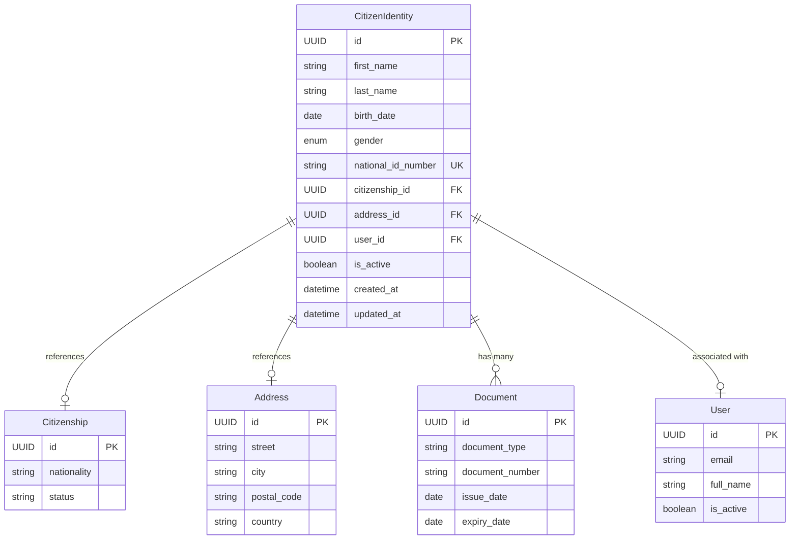

# Módulo de Identidade - SILA System

## Visão Geral

O módulo de **Identity** é o núcleo da identidade civil no SILA System, focando
exclusivamente nos dados pessoais imutáveis do cidadão. Este módulo foi projetado de
forma inteligente para **evitar duplicação de dados** ao reutilizar e referenciar os
módulos existentes de `citizenship`, `documents` e `address`.

## Princípios de Design

### 🎯 Foco no Núcleo da Identidade Civil

- **Dados imutáveis**: Nome, data de nascimento, gênero, número de identificação
  nacional
- **Referências inteligentes**: FK para outros módulos em vez de duplicar dados
- **Integridade**: Validação rigorosa e prevenção de duplicatas

### 🔗 Integração Inteligente

- **Citizenship**: Referencia `citizenship_id` sem duplicar nacionalidade
- **Documents**: Relacionamento one-to-many com `documents.Document`
- **Address**: Referencia `address_id` sem replicar endereço
- **Auth**: Associação opcional com `users.User`

## Arquitetura

### Modelo de Dados



### Relacionamentos

| Relacionamento | Tipo        | Descrição                             |
| -------------- | ----------- | ------------------------------------- |
| `citizenship`  | Many-to-One | Referencia dados de nacionalidade     |
| `address`      | Many-to-One | Referencia endereço atual             |
| `documents`    | One-to-Many | Lista de documentos vinculados        |
| `user`         | One-to-One  | Conta de usuário associada (opcional) |

## API Endpoints

### 🔐 Segurança

- **Admin Only**: Criação, atualização e exclusão
- **Permission Required**: `identity:read` para consultas
- **Owner Access**: Usuários podem acessar sua própria identidade

### Endpoints Disponíveis

#### POST `/api/v1/identity/`

**Criar Identidade** (Admin Only)

```json
{
  "first_name": "João",
  "last_name": "Silva",
  "birth_date": "1990-05-15",
  "gender": "male",
  "national_id_number": "12345678901",
  "citizenship_id": "550e8400-e29b-41d4-a716-446655440000",
  "address_id": "550e8400-e29b-41d4-a716-446655440001"
}
```

#### GET `/api/v1/identity/{identity_id}`

**Buscar por ID** (identity:read)

```json
{
  "id": "550e8400-e29b-41d4-a716-446655440000",
  "first_name": "João",
  "last_name": "Silva",
  "full_name": "João Silva",
  "birth_date": "1990-05-15",
  "age": 33,
  "gender": "male",
  "national_id_number": "12345678901",
  "citizenship": {
    "id": "550e8400-e29b-41d4-a716-446655440000",
    "nationality": "Angolan",
    "status": "active"
  },
  "address": {
    "id": "550e8400-e29b-41d4-a716-446655440001",
    "street": "Rua da Independência, 123",
    "city": "Luanda",
    "postal_code": "1000",
    "country": "Angola"
  },
  "documents": [
    {
      "id": "550e8400-e29b-41d4-a716-446655440002",
      "document_type": "BI",
      "document_number": "12345678901",
      "issue_date": "2020-01-15",
      "expiry_date": "2030-01-15",
      "is_active": true
    }
  ],
  "user": {
    "id": "550e8400-e29b-41d4-a716-446655440003",
    "email": "joao.silva@example.com",
    "full_name": "João Silva",
    "is_active": true
  }
}
```

#### GET `/api/v1/identity/national-id/{national_id_number}`

**Buscar por BI/NIF** (identity:read)

#### PUT `/api/v1/identity/{identity_id}`

**Atualizar Identidade** (Admin ou Owner)

#### DELETE `/api/v1/identity/{identity_id}`

**Excluir Identidade** (Admin Only, Soft Delete)

#### POST `/api/v1/identity/search`

**Buscar Identidades** (identity:read)

```json
{
  "first_name": "João",
  "last_name": "Silva",
  "is_active": true
}
```

#### GET `/api/v1/identity/stats`

**Estatísticas** (identity:read)

```json
{
  "total_identities": 1000,
  "active_identities": 950,
  "inactive_identities": 50,
  "identities_with_user_accounts": 800,
  "identities_without_user_accounts": 200,
  "average_age": 35.5,
  "gender_distribution": {
    "male": 500,
    "female": 450,
    "other": 50
  }
}
```

#### POST `/api/v1/identity/{identity_id}/associate-user/{user_id}`

**Associar com Usuário** (Admin Only)

#### GET `/api/v1/identity/my-identity`

**Minha Identidade** (Autenticado)

## Validações e Regras de Negócio

### ✅ Validações Implementadas

1. **Unicidade do BI/NIF**

   - Prevenção de duplicatas
   - Validação de formato
   - Normalização (maiúsculas)

2. **Validação de Datas**

   - Data de nascimento não pode ser futura
   - Limite mínimo (1900)
   - Cálculo automático de idade

3. **Validação de Nomes**

   - Não podem ser vazios
   - Capitalização automática
   - Remoção de espaços extras

4. **Validação de Relacionamentos**
   - Verificação de FK existentes
   - Prevenção de referências órfãs
   - Validação de usuário único

### 🔒 Regras de Segurança

1. **Imutabilidade**

   - BI/NIF não pode ser alterado após criação
   - Dados históricos preservados

2. **Soft Delete**

   - Exclusão lógica por padrão
   - Preservação de relacionamentos históricos
   - Opção de hard delete para admin

3. **Auditoria**
   - Rastreamento de criação/atualização
   - Logs de segurança
   - Histórico de alterações

## Integração com Outros Módulos

### 🔗 Citizenship Module

```python
# Referencia sem duplicação
identity.citizenship_id = citizenship_record.id
identity.citizenship.nationality  # Acesso aos dados
```

### 🏠 Address Module

```python
# Referencia sem duplicação
identity.address_id = address_record.id
identity.address.street  # Acesso aos dados
```

### 📄 Documents Module

```python
# Relacionamento one-to-many
identity.documents  # Lista de documentos
for doc in identity.documents:
    print(doc.document_type, doc.document_number)
```

### 👤 Auth Module

```python
# Associação opcional
identity.user_id = user.id
user.citizen_identity  # Acesso à identidade
```

## Casos de Uso

### 1. Registro de Novo Cidadão

```python
# 1. Criar identidade base
identity = await IdentityService.create_identity(
    db=db,
    identity_data=CitizenIdentityCreate(
        first_name="Maria",
        last_name="Santos",
        birth_date=date(1985, 3, 20),
        gender=GenderEnum.FEMALE,
        national_id_number="98765432109"
    )
)

# 2. Associar com endereço existente
identity.address_id = existing_address.id

# 3. Associar com nacionalidade
identity.citizenship_id = existing_citizenship.id

# 4. Criar documentos
document = Document(
    citizen_identity_id=identity.id,
    document_type="BI",
    document_number="98765432109"
)
```

### 2. Busca por BI

```python
# Busca rápida por número de identificação
identity = await IdentityService.get_identity_by_national_id(
    db=db,
    national_id_number="12345678901"
)

# Acesso a dados relacionados sem duplicação
print(f"Nome: {identity.full_name}")
print(f"Idade: {identity.age}")
print(f"Nacionalidade: {identity.citizenship.nationality}")
print(f"Endereço: {identity.address.street}")
```

### 3. Estatísticas do Sistema

```python
# Obter estatísticas completas
stats = await IdentityService.get_identity_statistics(db=db)

print(f"Total de identidades: {stats.total_identities}")
print(f"Idade média: {stats.average_age}")
print(f"Distribuição por gênero: {stats.gender_distribution}")
```

## Testes

### Cobertura de Testes

```bash
# Executar testes do módulo identity
pytest app/modules/identity/tests/ -v

# Com cobertura
pytest app/modules/identity/tests/ --cov=app.modules.identity --cov-report=html
```

### Cenários Testados

- ✅ Criação de identidade válida
- ❌ Falha ao duplicar BI/NIF
- ✅ Busca por BI existente
- ❌ Busca por BI inexistente
- ✅ Atualização de identidade
- ✅ Exclusão lógica (soft delete)
- ✅ Validação de relacionamentos
- ✅ Estatísticas e relatórios
- ✅ Segurança e permissões

## Performance e Otimização

### Índices de Banco de Dados

```sql
-- Índices para performance
CREATE INDEX idx_identity_national_id ON identity_citizen_identity(national_id_number);
CREATE INDEX idx_identity_last_name_birth_date ON identity_citizen_identity(last_name, birth_date);
CREATE INDEX idx_identity_user_id ON identity_citizen_identity(user_id);
CREATE INDEX idx_identity_citizenship_id ON identity_citizen_identity(citizenship_id);
CREATE INDEX idx_identity_address_id ON identity_citizen_identity(address_id);
```

### Estratégias de Cache

- Cache de identidades frequentemente acessadas
- Cache de estatísticas (TTL: 1 hora)
- Cache de relacionamentos (lazy loading)

## Monitoramento e Logs

### Logs de Segurança

```python
# Logs automáticos para auditoria
logger.info(f"Created identity: {identity.national_id_number}")
logger.warning(f"Duplicate BI attempt: {national_id}")
logger.error(f"Failed to validate FK: {citizenship_id}")
```

### Métricas

- Total de identidades criadas/atualizadas
- Tentativas de duplicação de BI
- Tempo de resposta das consultas
- Taxa de erro nas validações

## Roadmap

### Próximas Funcionalidades

- [ ] Validação de BI/NIF com algoritmo de verificação
- [ ] Integração com serviços externos de validação
- [ ] Histórico de alterações (audit trail)
- [ ] Exportação de dados para relatórios
- [ ] API de webhooks para notificações
- [ ] Cache distribuído com Redis
- [ ] Backup automático de dados críticos

### Melhorias de Performance

- [ ] Paginação otimizada para grandes volumes
- [ ] Índices compostos para consultas complexas
- [ ] Compressão de dados históricos
- [ ] Particionamento de tabelas por data

## Contribuição

### Padrões de Código

1. Seguir PEP 8
2. Documentar todas as funções públicas
3. Incluir testes para novas funcionalidades
4. Validar relacionamentos com outros módulos
5. Manter compatibilidade com APIs existentes

### Processo de Desenvolvimento

1. Criar branch para nova funcionalidade
2. Implementar com testes
3. Validar integração com outros módulos
4. Documentar mudanças
5. Submeter pull request

## Licença

Este módulo faz parte do SILA System e está sujeito à licença do projeto principal.

---

**Nota**: Este módulo foi projetado seguindo os princípios de **não duplicação de
dados** e **integração inteligente** com os módulos existentes, garantindo consistência
e eficiência no sistema.
