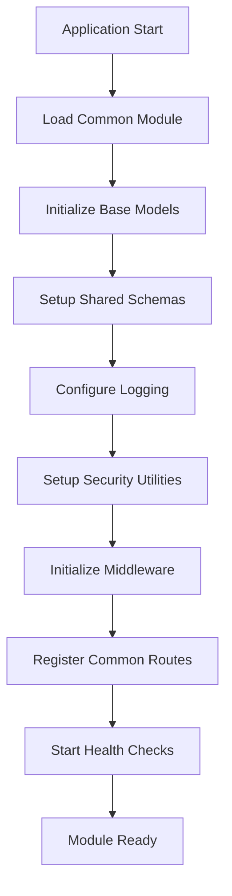
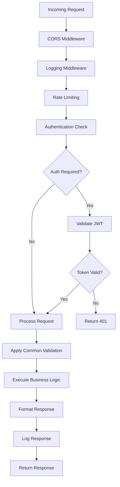

# Common Module

# SILA System - Backend

## 📋 Description

The Common module provides shared utilities, base models, and common functionalities
used across all modules in the SILA system. It serves as the foundation for consistent
data structures, validation schemas, and reusable components that ensure standardization
and maintainability across the entire platform.

## 🚀 Core Functionalities

- 🔧 **Base Models** - Common SQLAlchemy models for inheritance
- 📋 **Shared Schemas** - Reusable Pydantic validation schemas
- 🛠️ **Utility Functions** - Common helper functions and tools
- 🔐 **Security Utilities** - Shared security and authentication helpers
- 📊 **Data Validation** - Common validation patterns and rules
- 🔄 **Response Models** - Standardized API response structures
- 📝 **Logging Utilities** - Centralized logging configuration
- 🎯 **Error Handling** - Common exception handling patterns

## 📡 Available Endpoints

| Method | Endpoint          | Description               | Authentication | Rate Limit | Status    |
| ------ | ----------------- | ------------------------- | -------------- | ---------- | --------- |
| `GET`  | `/common/ping`    | Module health check       | ❌ Public      | 1000/hour  | ✅ Active |
| `GET`  | `/common/health`  | Detailed health status    | ❌ Public      | 100/hour   | ✅ Active |
| `GET`  | `/common/config`  | Public configuration info | ❌ Public      | 100/hour   | ✅ Active |
| `GET`  | `/common/status`  | System status overview    | ✅ Required    | 500/hour   | ✅ Active |
| `GET`  | `/common/metrics` | Basic system metrics      | ✅ Required    | 100/hour   | ✅ Active |

## 🔧 Configuration

### Technology Stack

- **Framework:** FastAPI with shared utilities
- **Database:** PostgreSQL with base models
- **Validation:** Pydantic schemas for consistency
- **Security:** JWT utilities and helpers
- **Logging:** Structured logging configuration
- **Testing:** Shared test utilities

### Environment Variables

```bash
# Common Module Configuration
COMMON_LOG_LEVEL=INFO
COMMON_LOG_FORMAT=json
COMMON_ENABLE_METRICS=true
COMMON_ENABLE_HEALTH_CHECKS=true

# Security Configuration
COMMON_JWT_ALGORITHM=HS256
COMMON_PASSWORD_MIN_LENGTH=8
COMMON_SESSION_TIMEOUT=3600

# Response Configuration
COMMON_DEFAULT_PAGE_SIZE=20
COMMON_MAX_PAGE_SIZE=100
COMMON_ENABLE_PAGINATION=true

# Cache Configuration
COMMON_CACHE_TTL=300
COMMON_ENABLE_CACHE=true
```

## 🗂️ Module Structure

```
common/
├── __init__.py          # Module initialization and exports (3075 lines)
├── endpoints.py         # Common API endpoints (1 endpoint)
├── models/              # Base SQLAlchemy models
│   ├── __init__.py
│   ├── base.py          # Base model with common fields
│   ├── audit.py         # Audit trail model
│   ├── user.py          # User base model
│   └── timestamp.py     # Timestamp mixin model
├── schemas/             # Shared Pydantic schemas
│   ├── __init__.py
│   ├── base.py          # Base response schemas
│   ├── user.py          # User validation schemas
│   ├── pagination.py    # Pagination schemas
│   ├── response.py      # Standard response models
│   └── error.py         # Error response schemas
├── services/            # Common business logic
│   ├── __init__.py
│   ├── base_service.py  # Base service class
│   ├── validation.py    # Validation utilities
│   └── helpers.py       # Helper functions
├── utils/               # Utility functions
│   ├── __init__.py
│   ├── security.py      # Security utilities
│   ├── logging.py       # Logging configuration
│   ├── datetime.py      # Date/time utilities
│   ├── encryption.py    # Encryption helpers
│   └── validators.py    # Custom validators
├── exceptions/          # Custom exceptions
│   ├── __init__.py
│   ├── base.py          # Base exception classes
│   ├── validation.py    # Validation exceptions
│   └── auth.py          # Authentication exceptions
├── middleware/          # Common middleware
│   ├── __init__.py
│   ├── logging.py       # Logging middleware
│   ├── cors.py          # CORS configuration
│   └── rate_limit.py    # Rate limiting middleware
├── tests/               # Shared test utilities
│   ├── __init__.py
│   ├── conftest.py      # Test configuration
│   ├── fixtures.py      # Test fixtures
│   └── helpers.py       # Test helpers
└── README.md            # This documentation
```

## 📚 Usage Examples

### FastAPI Integration Example

```python
from fastapi import FastAPI, Depends
from app.modules.common import router
from app.modules.common.schemas import BaseResponse, PaginatedResponse
from app.modules.common.models import BaseModel
from app.modules.common.services import BaseService

app = FastAPI(title="SILA Common API")
app.include_router(router, prefix="/common", tags=["common"])

# Using base model
class UserModel(BaseModel):
    username: str
    email: str

    class Config:
        from_attributes = True

# Using base service
class UserService(BaseService[UserModel]):
    model = UserModel

    async def get_active_users(self):
        return await self.get_all(active=True)

# Using common schemas
@app.get("/users", response_model=PaginatedResponse[UserModel])
async def get_users(page: int = 1, size: int = 20):
    service = UserService()
    users, total = await service.get_paginated(page=page, size=size)
    return PaginatedResponse.create(users, total, page, size)
```

### Complete HTTP Client Example

```bash
# Health check (public)
curl -X GET "http://localhost:8000/common/ping" \
  -H "Accept: application/json"

# Detailed health status (public)
curl -X GET "http://localhost:8000/common/health" \
  -H "Accept: application/json"

# Public configuration (public)
curl -X GET "http://localhost:8000/common/config" \
  -H "Accept: application/json"

# System status (authenticated)
curl -X GET "http://localhost:8000/common/status" \
  -H "Authorization: Bearer YOUR_JWT_TOKEN" \
  -H "Accept: application/json"

# System metrics (authenticated)
curl -X GET "http://localhost:8000/common/metrics" \
  -H "Authorization: Bearer YOUR_JWT_TOKEN" \
  -H "Accept: application/json"
```

### Frontend Integration Example

```typescript
// common-api.ts
import { apiClient } from '@/lib/api-client';

export interface SystemHealth {
  status: 'healthy' | 'unhealthy' | 'degraded';
  checks: {
    database: boolean;
    redis: boolean;
    storage: boolean;
  };
  timestamp: string;
  version: string;
}

export interface SystemMetrics {
  uptime: number;
  memory_usage: number;
  cpu_usage: number;
  active_connections: number;
  requests_per_minute: number;
}

export interface SystemConfig {
  api_version: string;
  features: {
    registration: boolean;
    notifications: boolean;
    payments: boolean;
  };
  limits: {
    max_file_size: number;
    max_requests_per_hour: number;
  };
}

export const commonAPI = {
  // Get system health
  async getHealth(): Promise<SystemHealth> {
    const response = await apiClient.get('/common/health');
    return response.data;
  },

  // Get system metrics
  async getMetrics(): Promise<SystemMetrics> {
    const response = await apiClient.get('/common/metrics');
    return response.data;
  },

  // Get system configuration
  async getConfig(): Promise<SystemConfig> {
    const response = await apiClient.get('/common/config');
    return response.data;
  },

  // Get system status
  async getStatus(): Promise<any> {
    const response = await apiClient.get('/common/status');
    return response.data;
  }
};

// React component example
import React, { useState, useEffect } from 'react';
import { commonAPI, SystemHealth } from '@/features/common/api';

export const SystemHealthDashboard: React.FC = () => {
  const [health, setHealth] = useState<SystemHealth | null>(null);
  const [loading, setLoading] = useState(true);

  useEffect(() => {
    const loadHealth = async () => {
      try {
        const systemHealth = await commonAPI.getHealth();
        setHealth(systemHealth);
      } catch (error) {
        console.error('Error loading system health:', error);
      } finally {
        setLoading(false);
      }
    };

    loadHealth();
    // Refresh every 30 seconds
    const interval = setInterval(loadHealth, 30000);
    return () => clearInterval(interval);
  }, []);

  if (loading) return <div>Loading system health...</div>;

  const getStatusColor = (status: string) => {
    switch (status) {
      case 'healthy': return 'green';
      case 'unhealthy': return 'red';
      case 'degraded': return 'yellow';
      default: return 'gray';
    }
  };

  return (
    <div className="system-health-dashboard">
      <h2>System Health</h2>
      <div className="status-indicator" style={{ color: getStatusColor(health?.status || 'unknown') }}>
        Status: {health?.status.toUpperCase()}
      </div>
      <div className="health-checks">
        <h3>Component Status</h3>
        <div>Database: {health?.checks.database ? '✅' : '❌'}</div>
        <div>Redis: {health?.checks.redis ? '✅' : '❌'}</div>
        <div>Storage: {health?.checks.storage ? '✅' : '❌'}</div>
      </div>
      <div className="system-info">
        <p>Version: {health?.version}</p>
        <p>Last checked: {new Date(health?.timestamp || '').toLocaleString()}</p>
      </div>
    </div>
  );
};
```

## 🔗 Dependencies

### Internal Dependencies

- **FastAPI** - Web framework foundation
- **SQLAlchemy** - ORM base models
- **Pydantic** - Validation schemas
- **Python-Jose** - JWT utilities
- **Passlib** - Password hashing
- **Python-Multipart** - File handling
- **Structlog** - Structured logging

### Module Dependencies

- `app.core.config` - Configuration management
- `app.db.session` - Database session management
- `app.core.security` - Core security functions

### External Dependencies

- **PostgreSQL** - Primary database
- **Redis** - Caching and session storage
- **Prometheus** - Metrics collection
- **Sentry** - Error tracking

## ⚠️ Important Observations

### Development Environment

- **Foundation module** - Changes affect all other modules
- **Version compatibility** - Must maintain backward compatibility
- **Testing critical** - Comprehensive test coverage required
- **Documentation essential** - Clear API documentation needed
- **Performance impact** - Optimizations benefit entire system

### Production Environment

- **High availability** - Critical for system stability
- **Monitoring essential** - Real-time health monitoring
- **Backup strategy** - Regular configuration backups
- **Security updates** - Prompt security patching
- **Performance monitoring** - Track impact on overall system

### Security Considerations

- **Shared security** - Security flaws affect all modules
- **Input validation** - Centralized validation reduces vulnerabilities
- **Authentication helpers** - Consistent auth patterns
- **Error handling** - Prevent information leakage
- **Logging security** - Avoid logging sensitive data

### Performance Considerations

- **Base model optimization** - Efficient database operations
- **Caching strategy** - Shared caching benefits all modules
- **Connection pooling** - Optimize database connections
- **Memory usage** - Monitor shared resource consumption
- **Response time** - Fast common utilities improve overall performance

## 🔒 Security Implementation

### Implemented Security Measures

- ✅ **Input Validation** - Centralized validation schemas
- ✅ **Password Security** - Secure password hashing utilities
- ✅ **JWT Handling** - Secure token management
- ✅ **Error Sanitization** - Safe error responses
- ✅ **Logging Security** - Secure logging practices
- ✅ **CORS Configuration** - Cross-origin security

### Security Recommendations

- 🔒 **Regular Security Audits** - Periodic security assessments
- 🔒 **Dependency Updates** - Keep security patches current
- 🔒 **Input Sanitization** - Enhanced input validation
- 🔒 **Rate Limiting** - Prevent abuse of common endpoints
- 🔒 **Security Headers** - Implement security HTTP headers
- 🔒 **Monitoring** - Security event monitoring

## 📊 Analytics and Monitoring

### Key Performance Indicators (KPIs)

- **API Response Time** - Average response time for common endpoints
- **Error Rate** - Percentage of failed requests
- **System Uptime** - Overall system availability
- **Database Performance** - Query execution times
- **Memory Usage** - System resource consumption
- **Cache Hit Rate** - Effectiveness of caching strategy

### Monitoring Metrics

```python
# Common module metrics
COMMON_METRICS = {
    'api_requests_total': Counter('common_api_requests_total'),
    'api_response_time': Histogram('common_api_response_time_seconds'),
    'error_rate': Gauge('common_error_rate'),
    'active_connections': Gauge('common_active_connections'),
    'memory_usage': Gauge('common_memory_usage_bytes'),
    'cache_hits': Counter('common_cache_hits_total'),
    'cache_misses': Counter('common_cache_misses_total'),
    'database_connections': Gauge('common_database_connections')
}
```

### Health Checks

```python
@app.get("/common/health")
async def health_check():
    checks = {
        "database": await check_database_connection(),
        "redis": await check_redis_connection(),
        "storage": await check_storage_connection(),
        "memory": check_memory_usage(),
        "cpu": check_cpu_usage()
    }

    overall_status = "healthy" if all(checks.values()) else "unhealthy"

    return {
        "status": overall_status,
        "checks": checks,
        "timestamp": datetime.utcnow().isoformat(),
        "version": "1.0.0"
    }
```

### Alerts Configuration

```yaml
# Common module alerts
alerts:
  - name: "High Error Rate"
    condition: "common_error_rate > 5%"
    severity: "warning"

  - name: "High Memory Usage"
    condition: "common_memory_usage > 80%"
    severity: "critical"

  - name: "Database Connection Issues"
    condition: "common_database_connections < 1"
    severity: "critical"

  - name: "Slow API Response"
    condition: "common_api_response_time > 2s"
    severity: "warning"
```

## 🔄 Workflow Diagrams

### Common Module Initialization Flow



### Request Processing Flow



## 👥 Responsibilities

### Development Team

- **Module Owner:** SILA Core Team
- **Lead Developer:** Common Module Lead
- **Backend Developers:** 2 developers
- **QA Engineer:** 1 tester
- **DevOps Engineer:** Infrastructure support

### Contact Information

- **Email:** dev@sila.gov.ao
- **Slack:** #sila-backend-common
- **Jira:** SILA-COMMON
- **Documentation:** https://docs.sila.gov.ao/common

### Support Hours

- **Development Support:** Monday - Friday, 9:00 - 18:00 (UTC+1)
- **Production Support:** 24/7 on-call rotation
- **Emergency Contact:** +244 923 456 789

## 📈 Change History

### Version 1.0.0 (Current)

- ✅ Initial module structure created
- ✅ Base SQLAlchemy models implemented
- ✅ Shared Pydantic schemas defined
- ✅ Common utility functions created
- ✅ Security utilities implemented
- ✅ Logging configuration added
- ✅ Middleware components created
- ✅ Health check endpoints active
- ✅ Error handling patterns established
- ✅ Test utilities implemented

### Version 1.1.0 (Planned)

- 📋 Enhanced validation schemas
- 📋 Advanced security utilities
- 📋 Performance monitoring tools
- 📋 Caching utilities
- 📋 Background task helpers
- 📋 API documentation improvements
- 📋 Enhanced error handling
- 📋 Metrics collection improvements
- 📋 Configuration management
- 📋 Testing framework enhancements

### Version 1.2.0 (Future)

- 📋 Advanced analytics utilities
- 📋 Machine learning helpers
- 📋 Event streaming utilities
- 📋 Distributed tracing
- 📋 Advanced caching strategies
- 📋 Performance optimization tools
- 📋 Security enhancements
- 📋 Monitoring dashboard
- 📋 Automated testing tools
- 📋 Documentation generators

## 🎯 Future Roadmap

### Short Term (Next 3 Months)

- [ ] Enhance validation schemas
- [ ] Implement advanced security utilities
- [ ] Add performance monitoring tools
- [ ] Create caching utilities
- [ ] Develop background task helpers
- [ ] Improve API documentation
- [ ] Enhance error handling
- [ ] Optimize metrics collection

### Medium Term (3-6 Months)

- [ ] Configuration management system
- [ ] Testing framework enhancements
- [ ] Advanced analytics utilities
- [ ] Machine learning helpers
- [ ] Event streaming utilities
- [ ] Distributed tracing
- [ ] Advanced caching strategies
- [ ] Performance optimization tools

### Long Term (6-12 Months)

- [ ] Security enhancements
- [ ] Monitoring dashboard
- [ ] Automated testing tools
- [ ] Documentation generators
- [ ] API versioning utilities
- [ ] Multi-tenant support
- [ ] Internationalization helpers
- [ ] Advanced debugging tools

---

_Technical documentation - SILA Common Module_ _Last updated: 2025-01-17 - SILA
Documentation Team_ _Status: Stable - Core Infrastructure Component_ _Next review:
2025-02-17_
