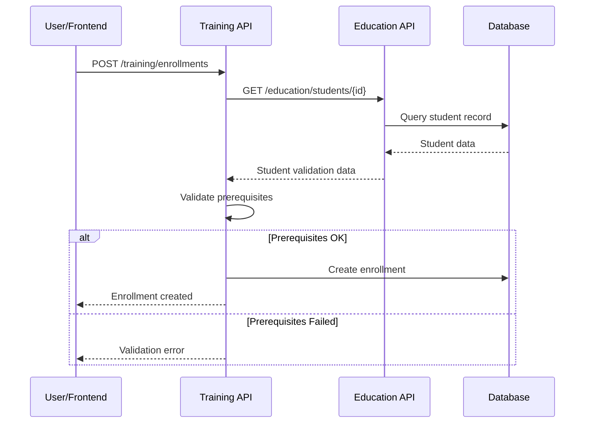
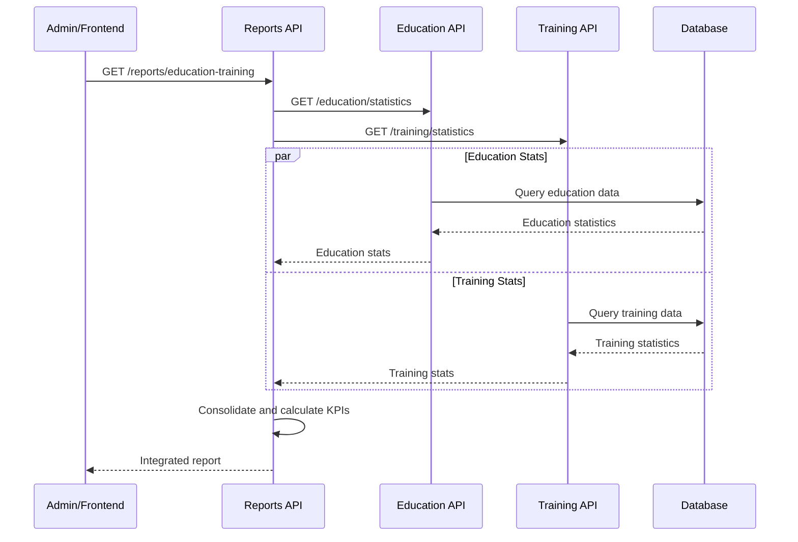

# Padrões de Integração Modular - SILA System

## Visão Geral

Este documento define os padrões arquiteturais para integração entre módulos no Sistema
SILA, demonstrados através do exemplo prático Education + Training + Reports.

## Princípios Fundamentais

### 1. Separação de Responsabilidades

- **Cada módulo** possui responsabilidade única e bem definida
- **Não duplicação** de dados entre módulos
- **APIs específicas** para exposição de funcionalidades

### 2. Comunicação Assíncrona

- **Chamadas async/await** para operações entre módulos
- **Validação cruzada** através de APIs internas
- **Agregação de dados** no módulo Reports

### 3. Validação Distribuída

- **Pré-requisitos** validados no módulo de origem
- **Regras de negócio** mantidas em cada módulo
- **Consistência** garantida através de validações cruzadas

## Padrões de Integração

### Padrão 1: Validação de Pré-requisitos

```python
# Training valida pré-requisitos consultando Education
async def validate_prerequisites(self, student_id: int, course_id: int) -> bool:
    student = await self.education_api.get_student_by_id(student_id)
    course = next((c for c in self.courses if c.course_id == course_id), None)

    if not student or not course:
        return False

    # Validação específica baseada nos dados do Education
    if "Ensino Secundário" in course.prerequisites:
        return student.level == EducationLevel.SECONDARY and student.final_grade >= 10

    return True
```

**Benefícios:**

- ✅ Dados não duplicados
- ✅ Validação em tempo real
- ✅ Regras centralizadas no módulo responsável

### Padrão 2: Agregação de Estatísticas

```python
# Reports agrega dados de múltiplos módulos
async def generate_education_training_report(self) -> Dict[str, Any]:
    education_stats = await self.education_api.get_statistics()
    training_stats = await self.training_api.get_statistics()

    # Consolidação inteligente dos dados
    for municipality in municipalities:
        edu_data = education_stats["by_municipality"].get(municipality, {})
        training_data = training_stats["by_municipality"].get(municipality, {})

        # Cálculo de KPIs derivados
        continuity_rate = (training_enrollments / secondary_graduates * 100)
```

**Benefícios:**

- ✅ Visão consolidada
- ✅ KPIs calculados automaticamente
- ✅ Dados sempre atualizados

### Padrão 3: Fluxo de Estados

```python
# Fluxo: Education (graduado) → Training (inscrito) → Reports (estatísticas)

# 1. Education: João se forma
joao = EducationRecord(
    student_id=1,
    level=EducationLevel.SECONDARY,
    final_grade=16.5,
    has_certificate=True
)

# 2. Training: João se inscreve (validação automática)
enrollment = await training_api.enroll_student(joao.student_id, course_id)

# 3. Reports: Dados consolidados automaticamente
report = await reports_api.generate_education_training_report()
```

## Arquitetura de APIs

### Education API - Pontos de Exposição

| Endpoint                       | Propósito                    | Usado por              |
| ------------------------------ | ---------------------------- | ---------------------- |
| `GET /education/students/{id}` | Histórico escolar individual | Training (validação)   |
| `GET /education/graduates`     | Lista graduados por critério | Training (descoberta)  |
| `GET /education/statistics`    | Estatísticas agregadas       | Reports (consolidação) |

### Training API - Pontos de Exposição

| Endpoint                     | Propósito                   | Usado por              |
| ---------------------------- | --------------------------- | ---------------------- |
| `POST /training/enrollments` | Inscrição com validação     | Frontend, Integrations |
| `GET /training/statistics`   | Estatísticas de capacitação | Reports (consolidação) |
| `GET /training/courses`      | Cursos disponíveis          | Frontend, Service Hub  |

### Reports API - Pontos de Consolidação

| Endpoint                              | Propósito           | Dados Origem         |
| ------------------------------------- | ------------------- | -------------------- |
| `GET /reports/education-training`     | Relatório integrado | Education + Training |
| `GET /reports/education-training/kpi` | KPIs consolidados   | Education + Training |
| `GET /reports/dashboard`              | Dados para painel   | Múltiplos módulos    |

## Fluxos de Dados Detalhados

### Fluxo 1: Inscrição em Curso Técnico



### Fluxo 2: Geração de Relatórios



## Implementação Técnica

### 1. Injeção de Dependências

```python
class TrainingAPI:
    def __init__(self, education_api: EducationAPI):
        self.education_api = education_api  # Dependência injetada

class ReportsAPI:
    def __init__(self, education_api: EducationAPI, training_api: TrainingAPI):
        self.education_api = education_api
        self.training_api = training_api
```

### 2. Validação Assíncrona

```python
async def enroll_student(self, student_id: int, course_id: int):
    # Validação cruzada assíncrona
    if not await self.validate_prerequisites(student_id, course_id):
        return None

    # Verificação de capacidade
    course = self._get_course(course_id)
    if course.current_enrolled >= course.max_participants:
        return None

    # Criação da inscrição
    return self._create_enrollment(student_id, course_id)
```

### 3. Agregação Inteligente

```python
async def generate_consolidated_report(self):
    # Busca paralela de dados
    education_task = asyncio.create_task(self.education_api.get_statistics())
    training_task = asyncio.create_task(self.training_api.get_statistics())

    education_stats, training_stats = await asyncio.gather(
        education_task, training_task
    )

    # Consolidação e cálculo de KPIs
    return self._consolidate_data(education_stats, training_stats)
```

## Benefícios da Arquitetura

### ✅ Escalabilidade

- Módulos independentes podem escalar separadamente
- Adição de novos módulos sem impacto nos existentes
- APIs bem definidas facilitam integrações

### ✅ Manutenibilidade

- Responsabilidades claras por módulo
- Mudanças isoladas em cada domínio
- Testes independentes por módulo

### ✅ Reutilização

- APIs podem ser consumidas por múltiplos clientes
- Lógica de negócio centralizada em cada módulo
- Padrões consistentes entre integrações

### ✅ Observabilidade

- Métricas específicas por módulo
- Logs estruturados de integrações
- Monitoramento de fluxos de dados

## Exemplos de Uso Real

### Cenário 1: Cidadão João

1. **Education**: João conclui ensino secundário (nota 16.5, frequência 90%)
2. **Training**: João se inscreve em "Técnico em Eletricidade" (pré-requisitos validados
   automaticamente)
3. **Reports**: Dados de João contribuem para estatísticas municipais de continuidade
   educacional

### Cenário 2: Gestão Municipal

1. **Reports**: Administrador consulta dashboard municipal
2. **Agregação**: Sistema consolida dados de Education + Training em tempo real
3. **KPIs**: Taxa de continuidade, empregabilidade e distribuição por cursos calculados
   automaticamente

### Cenário 3: Planejamento Estratégico

1. **Reports**: Relatório anual de educação e capacitação
2. **Análise**: Identificação de gaps entre formação e demanda do mercado
3. **Decisão**: Criação de novos cursos técnicos baseada em dados consolidados

## Próximos Passos

### Expansão da Integração

- [ ] Integrar módulo **Social** (benefícios para estudantes)
- [ ] Conectar **Finance** (custos de programas educacionais)
- [ ] Incluir **Health** (programas de saúde escolar)

### Melhorias Técnicas

- [ ] Cache distribuído para consultas frequentes
- [ ] Event sourcing para auditoria de mudanças
- [ ] GraphQL para consultas flexíveis entre módulos

### Monitoramento Avançado

- [ ] Métricas de performance de integrações
- [ ] Alertas para inconsistências de dados
- [ ] Dashboard de saúde das APIs

## Conclusão

A arquitetura modular do SILA-System permite:

- **Integração inteligente** sem duplicação de dados
- **Validações distribuídas** mantendo consistência
- **Relatórios consolidados** com KPIs automáticos
- **Escalabilidade** e **manutenibilidade** do sistema

O exemplo Education + Training + Reports demonstra como módulos independentes podem
colaborar efetivamente, mantendo suas responsabilidades específicas enquanto fornecem
valor agregado através da integração.
