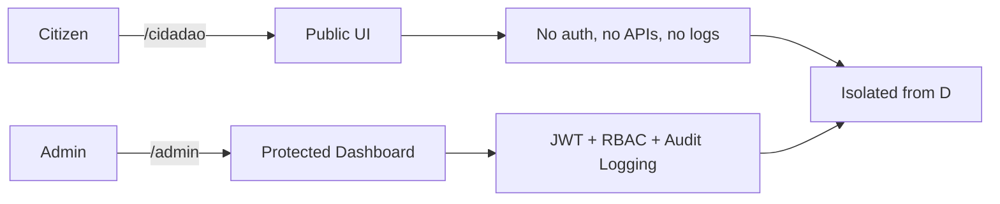
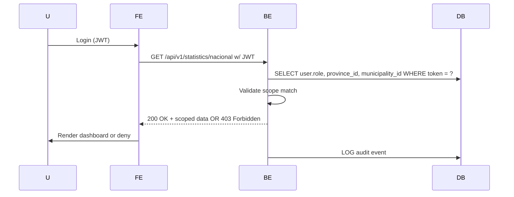

# Arquitetura Atualizada do Sistema SILA

## Visão Geral

O Sistema Integrado Local de Administração (SILA) foi reestruturado para adotar uma
arquitetura modular, escalável e institucionalmente robusta. Esta documentação descreve
a nova estrutura do sistema após a implementação dos cinco pilares estratégicos.

## Pilares Estratégicos

### 1. Módulo Registry (Cadastro Único)

**Função Estratégica**: Centralização do cadastro de munícipes, servindo como fonte
única de verdade para informações dos cidadãos.

**Componentes Principais**:

- `models/citizen.py`: Modelo de dados para cadastro de cidadãos
- Serviços de validação e deduplicação de registros
- APIs para consulta e atualização de dados cadastrais

### 2. Módulo Governance (Governança)

**Função Estratégica**: Gestão institucional, auditoria e compliance do sistema.

**Componentes Principais**:

- `models/audit_log.py`: Registro de todas as operações críticas do sistema
- Sistema de permissões e controle de acesso
- Relatórios de governança e compliance

### 3. Módulo Finance (Finanças)

**Função Estratégica**: Gestão de receitas públicas e integração bancária.

**Componentes Principais**:

- `models/payment.py`: Registro de pagamentos de taxas e serviços
- `models/transaction.py`: Transações financeiras com instituições bancárias
- `services/payment.py`: Serviços para processamento de pagamentos

### 4. Módulo Integration (Integração)

**Função Estratégica**: Hub de APIs externas e conectividade com sistemas parceiros.

**Componentes Principais**:

- `adapters/bna_adapter.py`: Adaptador para integração com o Banco Nacional de Angola
- Conectores para sistemas governamentais
- Serviços de transformação e normalização de dados

### 5. Módulo Health (Saúde)

**Função Estratégica**: Gestão de saúde municipal (padronizado após mesclagem).

**Componentes Principais**:

- Gestão de unidades de saúde
- Agendamento de consultas
- Registro de atendimentos

## Diagrama de Arquitetura Modular

```
+-------------------+       +-------------------+       +-------------------+
|                   |       |                   |       |                   |
|     Frontend      |------>|     Backend       |------>|     Databases     |
|                   |       |                   |       |                   |
+-------------------+       +-------------------+       +-------------------+
         |                           |
         |                           |
         v                           v
+-------------------+       +-------------------+
|                   |       |                   |
|  External APIs    |<----->|  Integration Hub  |
|                   |       |                   |
+-------------------+       +-------------------+
```

## Fluxo de Dados Entre Módulos

### Fluxo de Registro e Pagamento

1. O cidadão é registrado no módulo **Registry**
2. Seus dados são utilizados para serviços no módulo **Health**
3. Pagamentos de taxas são processados pelo módulo **Finance**
4. Transações bancárias são realizadas via módulo **Integration**
5. Todas as operações são auditadas pelo módulo **Governance**

## Estratégia de Integração

### Integração com BNA (Banco Nacional de Angola)

A integração com o BNA é realizada através do adaptador `bna_adapter.py` no módulo
Integration, que oferece:

- Consulta de taxas de câmbio
- Validação de contas bancárias
- Processamento de transações interbancárias

### Integração com SIMPLIFICA 2.0

A integração com o sistema SIMPLIFICA 2.0 permitirá:

- Sincronização de cadastros de cidadãos
- Compartilhamento de informações sobre licenciamentos
- Validação cruzada de documentos

## Padronização de Módulos

Todos os módulos seguem uma estrutura padronizada:

```
modulo/
  ├── models/
  │   └── __init__.py
  ├── routes/
  │   └── __init__.py
  ├── services/
  │   └── __init__.py
  ├── tests/
  │   └── __init__.py
  ├── schemas/
  │   └── __init__.py
  ├── utils/
  │   └── __init__.py
  ├── __init__.py
  └── README.md
```

## Próximos Passos

1. **Desenvolvimento de Conteúdo Inicial**:

   - Implementação de modelos e serviços básicos para cada módulo
   - Criação de APIs RESTful para acesso aos recursos

2. **Integração Frontend**:

   - Desenvolvimento de interfaces para os novos módulos
   - Implementação de fluxos de trabalho integrados

3. **Testes e Validação**:

   - Criação de testes unitários e de integração
   - Validação de fluxos de dados entre módulos

4. **Documentação Detalhada**:
   - Documentação técnica de APIs
   - Manuais de usuário para novos módulos

## Arquitetura Atualizada

### 7.1. Dual Portal Architecture

O sistema SILA implementa uma arquitetura de portais duplos com isolamento absoluto
entre o portal do cidadão e o portal administrativo.



**Características dos Portais:**

| Feature        | Citizen Portal (`/cidadao`)                                                | Admin Portal (`/admin`)                                                              |
| -------------- | -------------------------------------------------------------------------- | ------------------------------------------------------------------------------------ |
| **Access**     | Public + authenticated citizen                                             | JWT + `role: admin` + scope validation                                               |
| **UI**         | Minimalist, action-driven cards. Zero charts, zero tables, zero analytics. | Rich dashboard: maps, KPIs, trends, AI alerts.                                       |
| **Navigation** | NO links, menus, or references to `/admin`.                                | NO visibility in `/cidadao` — not even in source or console.                         |
| **Security**   | No auth middleware beyond basic session.                                   | All routes protected by `RoleGuard.tsx` + backend `@require_scope()` decorator.      |
| **Footprint**  | No audit logs, no metrics, no Sentry traces triggered from here.           | Full observability: structured logs, audit trail, Prometheus metrics, Sentry events. |

> 🔒 **Non-negotiable**: A citizen user must receive `403 Forbidden` (not 404) if
> accessing `/api/v1/statistics/nacional` directly. Never hint at existence.

### 7.2. RBAC Scope Matrix

O sistema implementa um modelo de controle de acesso baseado em roles (RBAC) com escopos
hierárquicos.

| Role             | Accessible Endpoints         | Data Scope          | Map Visibility       |
| ---------------- | ---------------------------- | ------------------- | -------------------- |
| Central Admin    | `/statistics/nacional`       | All provinces/munis | National map         |
| Provincial Admin | `/statistics/provincia/{id}` | One province        | Province + its munis |
| Municipal Admin  | `/statistics/municipio/{id}` | One muni            | Single point         |

**Implementação de Segurança:**

```python
@router.get("/nacional")
@require_role("admin")
@require_scope("national")
async def get_national_stats(current_user: User = Depends(get_current_admin_user)):
    # Endpoint implementation
```

### 7.3. Auth Flow



### 7.4. Security Boundaries

> The citizen portal has **zero awareness** of the admin portal. No shared components,
> no common route prefixes, no environment variables exposing admin endpoints. This is
> enforced by **code separation**, **routing isolation**, and **build-time exclusion**.

**Componentes de Segurança Implementados:**

1. **Frontend Security:**

   - `RoleGuard.tsx`: Verificação de roles e permissões
   - Isolamento completo de rotas `/admin` do portal cidadão
   - Remoção de todos os links administrativos do portal público

2. **Backend Security:**

   - Decorators `@require_role()` e `@require_scope()`
   - Validação de escopo baseada em `province_id` e `municipality_id`
   - Middleware de auditoria para todas as ações administrativas

3. **Audit Logging:**
   - Log automático de todas as ações administrativas
   - Rastreamento de acessos a endpoints de estatísticas
   - Registro de tentativas de acesso não autorizado

### 7.5. Dashboard Administrativo

O dashboard administrativo implementa:

- **Mapas Interativos**: Visualização geográfica com marcadores coloridos por atividade
- **KPIs em Tempo Real**: Métricas de conformidade, programas ativos, municípios
  conectados
- **Gráficos Dinâmicos**: Tendências de conformidade, distribuição por província
- **Alertas Inteligentes**: Sistema de alertas baseado em IA
- **Recomendações**: Sugestões automatizadas para melhorias

**Tecnologias Utilizadas:**

- React Leaflet para mapas interativos
- Recharts para visualizações de dados
- Tailwind CSS para interface responsiva
- React Query para gerenciamento de estado

## Conclusão

A nova arquitetura modular do SILA proporciona maior escalabilidade, manutenibilidade e
robustez ao sistema. A clara separação de responsabilidades entre os módulos facilita o
desenvolvimento paralelo e a evolução independente de cada componente, garantindo que o
sistema possa crescer de forma sustentável para atender às necessidades futuras da
administração municipal.

A implementação do sistema de portais duplos com isolamento absoluto garante a segurança
e privacidade dos dados, enquanto o dashboard administrativo oferece visibilidade
completa sobre o desempenho do sistema em todos os níveis hierárquicos.
