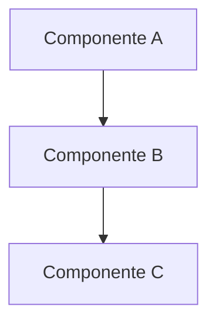

# 📋 Template de Documentação SILA

> **Template padrão para toda documentação do projeto SILA**

## 🎯 Propósito

[Descreva brevemente o propósito deste documento]

## 📋 Índice

- [Visão Geral](#visão-geral)
- [Pré-requisitos](#pré-requisitos)
- [Configuração](#configuração)
- [Uso](#uso)
- [Troubleshooting](#troubleshooting)
- [Referências](#referências)

---

## 🚀 Visão Geral

### Objetivo

[Qual o objetivo principal deste documento/componente]

### Funcionalidades Principais

- ✅ [Funcionalidade 1]
- ✅ [Funcionalidade 2]
- ✅ [Funcionalidade 3]

### Arquitetura



---

## 🔧 Pré-requisitos

### Software Necessário

- [ ] [Software 1] - Versão X.X+
- [ ] [Software 2] - Versão Y.Y+

### Configurações do Sistema

```bash
# Comandos de verificação
[comando de verificação 1]
[comando de verificação 2]
```

### Permissões

- [ ] Permissão A
- [ ] Permissão B

---

## ⚙️ Configuração

### Passo 1: [Título do Passo 1]

```bash
# Comando de configuração
comando_de_configuracao
```

**O que faz:**

- ✅ Ação 1
- ✅ Ação 2

### Passo 2: [Título do Passo 2]

```bash
# Comando de configuração
outro_comando
```

**Validação:**

```bash
# Comando de verificação
comando_de_validacao
```

---

## 🎯 Uso

### Caso de Uso 1: [Descrição do Caso]

```bash
# Comando de uso
comando_de_uso
```

**Parâmetros:**

- `--param1`: Descrição do parâmetro
- `--param2`: Descrição do parâmetro

**Exemplo de Saída:**

```json
{
  "status": "success",
  "data": {}
}
```

### Caso de Uso 2: [Descrição do Caso]

```python
# Código exemplo
def exemplo():
    return "funcionando"
```

---

## 🆘 Troubleshooting

### Problema Comum 1

**Sintoma:** [Descrição do sintoma]

**Causa:** [Possível causa]

**Solução:**

```bash
# Comando de correção
comando_correcao
```

### Problema Comum 2

**Sintoma:** [Descrição do sintoma]

**Causa:** [Possível causa]

**Solução:**

```bash
# Comando de correção
outro_comando_correcao
```

---

## 📚 Referências

### Documentação Relacionada

- [📖 Nome do Documento](./caminho/do/documento.md)

### Links Externos

- [🔗 Título do Link](https://exemplo.com)

### Arquivos de Configuração

- `caminho/do/arquivo.conf`

---

## 🔄 Histórico de Versões

| Versão | Data       | Autor   | Mudanças       |
| ------ | ---------- | ------- | -------------- |
| 1.0.0  | 2025-10-23 | [Autor] | Versão inicial |

---

## 📞 Suporte

**Contato Principal:** [nome] - [email] **Canal de Suporte:** [canal] **Horário de
Atendimento:** [horário]

> **⚠️ IMPORTANTE:** Sempre consulte este template ao criar nova documentação
