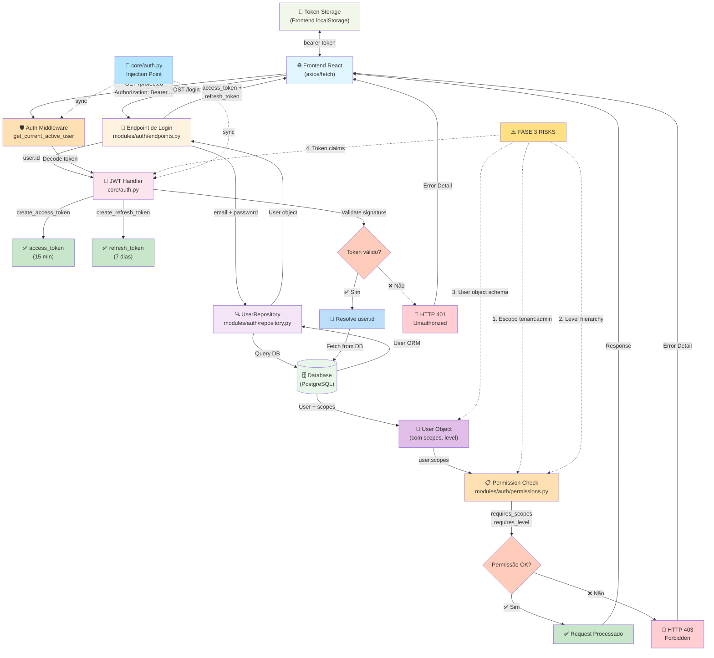
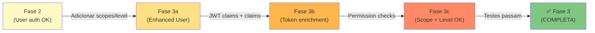

# 🔐 Fluxograma da Fase 3 (Auth) — SILA System

## Diagrama de Fluxo de Autenticação e Migração



---

## 📊 Estados e Transições Críticas

| Fase | Component         | Estado           | Status       | Observação                                |
| ---- | ----------------- | ---------------- | ------------ | ----------------------------------------- |
| 1️⃣   | `endpoints.py`    | Login iniciado   | ✅ OK        | POST /login aceita JSON, form, query      |
| 2️⃣   | `repository.py`   | Fetch user       | ✅ OK        | Query DB por email/password               |
| 3️⃣   | `core/auth.py`    | JWT criação      | ✅ OK        | Tokens com claims básicos                 |
| 4️⃣   | Middleware        | Token decode     | ✅ OK        | Suporta fallback de secrets               |
| 5️⃣   | `user.py` (model) | User object      | ⚠️ VERIFICAR | Faltam campos `scopes`, `role` no ORM     |
| 6️⃣   | `permissions.py`  | Scope validation | ⚠️ FALHA     | `tenant:admin` não aparece em user.scopes |
| 7️⃣   | `permissions.py`  | Level validation | ✅ OK        | Hierarquia `local < provincial < central` |
| 8️⃣   | Response          | Authorized       | ❌ FALHA     | HTTP 403 quando deveria ser 200           |

---

## 🔴 Pontos de Falha Identificados

### **Falha #1: Escopo `tenant:admin` não é populado**

**Localização:** `modules/auth/models/user.py` (ORM) + `modules/auth/repository.py`
(fetch)

**Problema:**

- O modelo ORM `User` não possui campo `scopes` (lista de strings)
- O repositório não extrai/calcula escopos ao retornar usuário

**Manifestação:**

```python
# Em permissions.py:requires_scopes()
user_scopes = getattr(user, "scopes", [])  # Retorna [] sempre!
```

**Solução:** Adicionar campo `scopes` ao modelo `User` ou calcular dinamicamente no
repositório.

---

### **Falha #2: User.level é enum, não string**

**Localização:** `modules/auth/models/user.py` (ORM)

**Problema:**

- Banco de dados armazena como `Enum.value` (string)
- ORM retorna como `Enum` object
- `permissions.py:requires_level()` tenta comparar enum contra string

**Manifestação:**

```python
# Em permissions.py
user_level_str = user_level.value if isinstance(user_level, Enum) else user_level
# Funciona, mas frágil
```

**Solução:** Padronizar sempre retornar como string no DTO (`UserRead`).

---

### **Falha #3: JWT claims não incluem scopes/level**

**Localização:** `core/auth.py` (token creation)

**Problema:**

- `create_access_token()` recebe apenas `subject` (user_id)
- Não inclui `scopes`, `level`, `role` no payload

**Manifestação:**

```python
# Em endpoints.py:login()
access = create_access_token(subject=str(user.id))  # ❌ Sem scopes!
```

**Solução:** Incluir `additional_claims` com scopes/level no token.

---

## 🔄 Fluxo de Migração Esperado (Fase 3 → Completa)



---

## 📋 Checklist de Validação Rápida

- [ ] `User.scopes` (campo) existe no ORM
- [ ] `UserRead.scopes` (DTO) existe e é `List[str]`
- [ ] `create_access_token()` inclui `scopes` em `additional_claims`
- [ ] `create_access_token()` inclui `level` em `additional_claims`
- [ ] `get_current_active_user()` extrai `scopes` do token decodificado
- [ ] `requires_scopes()` valida contra `user.scopes` (lista)
- [ ] `requires_level()` valida contra `user.level` (string)
- [ ] Testes cobrem `tenant:admin` scope
- [ ] Testes cobrem `central` level
- [ ] `test_auth.py` passa com 100% de cobertura
