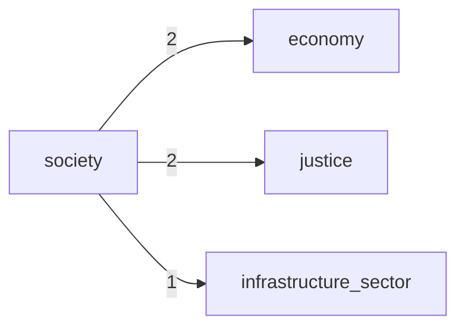

# Context Map

- Generated at: `2026-03-07 21:22:12Z`
- Modules in map: **4**
- Cross-context edges: **3**
- Circular groups: **0**

## Relations

| Source | Target | Weight |
| --- | --- | ---: |
| `society` | `economy` | 2 |
| `society` | `justice` | 2 |
| `society` | `infrastructure_sector` | 1 |

## Mermaid

## Circular Dependencies

- None.
