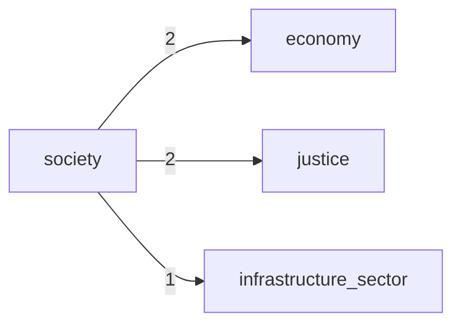

# Data Flow

## Module Dependency Flow (Top 25)

| Source | Target | Weight |
| --- | --- | ---: |
| `society` | `economy` | 2 |
| `society` | `justice` | 2 |
| `society` | `infrastructure_sector` | 1 |

## Mermaid

_Auto-generated by `scripts/architecture/generate_architecture_index.py`._
