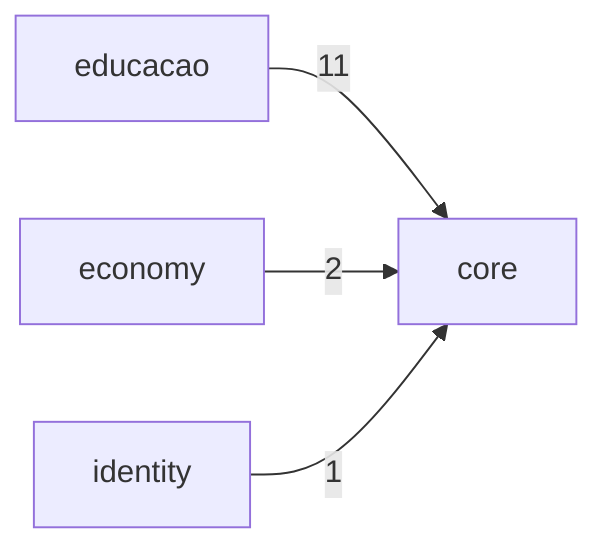

# Data Flow

## Module Dependency Flow (Top 25)

| Source | Target | Weight |
| --- | --- | ---: |
| `educacao` | `core` | 11 |
| `economy` | `core` | 2 |
| `identity` | `core` | 1 |

## Mermaid

_Auto-generated by `scripts/architecture/generate_architecture_index.py`._
