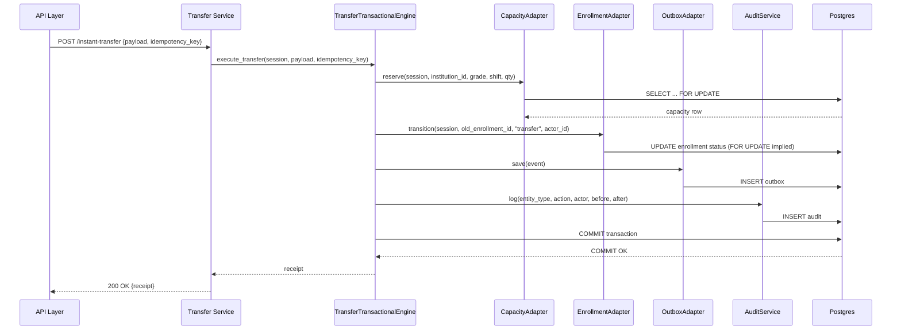

# Transactional Core Spec — Transfer & Enrollment

Date: 2026-05-27

This extended specification complements the RFC and includes a sequence diagram (Mermaid), concrete adapter examples and a sample usage snippet.

## High-level Sequence



## Adapter Examples (usage)

- `SQLAlchemyCapacityReservationAdapter` wraps `SQLAlchemyCapacityRepository` and exposes `reserve(session, institution_id, grade, shift, quantity)`.
- `SQLAlchemyEnrollmentStateMachineAdapter` wraps `SQLAlchemyEnrollmentRepository` and exposes `transition(session, enrollment_id, event, actor_id)`.

### Example usage snippet (pseudo-code)

```python
async def api_handler(payload, idempotency_key):
    async with AsyncSession(engine) as session:
        engine_impl = TransferTransactionalEngine(
            capacity=SQLAlchemyCapacityReservationAdapter(session),
            enrollment_sm=SQLAlchemyEnrollmentStateMachineAdapter(session),
            outbox=OutboxRepositoryAdapter(session),
            audit=AuditAdapter(session),
        )
        receipt = await engine_impl.execute_transfer(session, payload, idempotency_key)
        return receipt
```

## Adapter Contracts

- Adapters must not call `session.commit()` or `session.rollback()` — the `AsyncSession` transaction boundary is owned by the caller (engine/service).
- Adapters must be lightweight wrappers that forward to existing repositories where possible.
- Any new behavior (TTL reservations, compensation) must be opt-in and tested.

## Lock Ordering

To avoid deadlocks, define canonical lock acquisition order for the transfer pipeline:

1. Capacity row (`institution_capacity`) — `FOR UPDATE`
2. Enrollment row(s) — `FOR UPDATE`
3. Transfer record row (if updated)
4. Outbox/audit inserts (no locks required beyond normal INSERT)

Always acquire locks in the same order across services.

## Concrete adapter examples

See implementations in:

- `apps/backend/app/foundation/transactional/adapters/sqlalchemy_capacity_adapter.py`
- `apps/backend/app/foundation/transactional/adapters/sqlalchemy_enrollment_adapter.py`

### Notes on `SQLAlchemyCapacityReservationAdapter`

- Delegates to `reserve_capacity(institution_id, grade, shift, quantity)` which uses `with_for_update()`.
- Returns `None` if not enough available seats; engine must handle this and raise domain error.

### Notes on `SQLAlchemyEnrollmentStateMachineAdapter`

- Implements a minimal event→status mapping: `activate`, `pending`, `transfer`, `complete`.
- For more complex workflows, compose with audit/outbox adapters inside the engine.

## Testing

- Add unit tests for both adapters that assert they forward to repositories correctly.
- Add an integration test that runs `TransferTransactionalEngine.execute_transfer` inside a DB transaction and asserts capacity and enrollment state after commit.
- Add a concurrency test where N parallel transfer requests target the same capacity; assert no overbooking.

## Migration and Rollout

1. Add adapters and engine skeleton behind feature flag.
2. Route `transfer_transaction_service` to call the engine when flag enabled.
3. Run integration and concurrency tests in staging with realistic workloads.
4. Gradually remove legacy code once proven.

