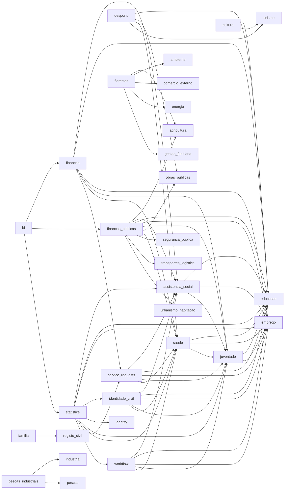

# AI Architecture Graph Visual Report

- Generated at: `2026-03-07 13:24:26Z`
- Output: `/home/dev03wsl/sila-system/reports/ai_architecture_graph_visual_report.md`

## Summary

- Modules in graph: **62**
- Dependency edges: **65**
- Layered architecture compliant: **62**
- Modules with entities: **61**
- Modules with use cases: **62**
- Modules with API routes listed: **11**

## Edge Table

| Source | Target |
| --- | --- |
| `assistencia_social` | `educacao` |
| `assistencia_social` | `emprego` |
| `assistencia_social` | `juventude` |
| `bi` | `financas` |
| `bi` | `financas_publicas` |
| `bi` | `statistics` |
| `cultura` | `educacao` |
| `cultura` | `turismo` |
| `desporto` | `educacao` |
| `desporto` | `obras_publicas` |
| `desporto` | `saude` |
| `desporto` | `turismo` |
| `familia` | `registo_civil` |
| `financas` | `assistencia_social` |
| `financas` | `educacao` |
| `financas` | `emprego` |
| `financas` | `juventude` |
| `financas` | `saude` |
| `financas` | `service_requests` |
| `financas_publicas` | `agricultura` |
| `financas_publicas` | `assistencia_social` |
| `financas_publicas` | `educacao` |
| `financas_publicas` | `emprego` |
| `financas_publicas` | `juventude` |
| `financas_publicas` | `obras_publicas` |
| `financas_publicas` | `saude` |
| `financas_publicas` | `seguranca_publica` |
| `financas_publicas` | `transportes_logistica` |
| `financas_publicas` | `urbanismo_habitacao` |
| `florestas` | `agricultura` |
| `florestas` | `ambiente` |
| `florestas` | `comercio_externo` |
| `florestas` | `energia` |
| `florestas` | `gestao_fundiaria` |
| `identidade_civil` | `assistencia_social` |
| `identidade_civil` | `educacao` |
| `identidade_civil` | `emprego` |
| `identidade_civil` | `juventude` |
| `identidade_civil` | `saude` |
| `juventude` | `educacao` |
| `juventude` | `emprego` |
| `pescas_industriais` | `industria` |
| `pescas_industriais` | `pescas` |
| `saude` | `educacao` |
| `saude` | `emprego` |
| `saude` | `juventude` |
| `service_requests` | `assistencia_social` |
| `service_requests` | `educacao` |
| `service_requests` | `emprego` |
| `service_requests` | `juventude` |
| `service_requests` | `saude` |
| `statistics` | `assistencia_social` |
| `statistics` | `educacao` |
| `statistics` | `emprego` |
| `statistics` | `identidade_civil` |
| `statistics` | `identity` |
| `statistics` | `juventude` |
| `statistics` | `saude` |
| `statistics` | `service_requests` |
| `statistics` | `workflow` |
| `workflow` | `assistencia_social` |
| `workflow` | `educacao` |
| `workflow` | `emprego` |
| `workflow` | `juventude` |
| `workflow` | `saude` |

## Mermaid Graph (Top 80 Edges)

