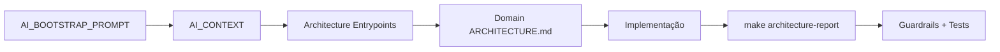

# AI Bootstrap Integration Report

- Generated at: `2026-03-07`
- Scope: `Architecture Entry Points + Semantic Index Layer + AI Context Gateway`

## Executive Status

| Item | Status |
| --- | --- |
| AI Entry Ritual formalizado | ✅ |
| AI Bootstrap Prompt integrado | ✅ |
| AI Context Gateway integrado | ✅ |
| Semantic Repository Map integrado | ✅ |
| Domain `ARCHITECTURE.md` por domínio | ✅ |
| AI scope reduzido por `include` | ✅ |
| Guardrail de bootstrap/context stack | ✅ |
| Duplicidade removida (`SILA_DOMAIN_MAP.md`) | ✅ |

## Delivered Artifacts

- `docs/AI_BOOTSTRAP_PROMPT.md`
- `docs/AI_CONTEXT.md`
- `docs/architecture/REPOSITORY_MAP.yaml`
- `docs/architecture/entrypoints/SYSTEM_OVERVIEW.md`
- `docs/architecture/entrypoints/BACKEND_ARCHITECTURE.md`
- `docs/architecture/entrypoints/DOMAIN_MAP.md`
- `docs/architecture/entrypoints/API_ENTRYPOINTS.md`
- `docs/architecture/entrypoints/DATA_FLOW.md`
- `docs/architecture/domains/*/ARCHITECTURE.md`
- `ARCHITECTURE_INDEX.yaml`
- `ARCHITECTURE_DEPENDENCIES.yaml`
- `API_MAP.yaml`
- `AI_ENTRYPOINTS.yaml`
- `reports/architecture_index_visual_report.md`

## Automation and Guardrails

- Generator único: `scripts/architecture/generate_architecture_index.py`
- Bootstrap command: `bash scripts/ai/bootstrap_context.sh`
- Scope filter: `python3 scripts/ai/ai_scope_filter.py --repo-root . --print-count`
- Guardrail stack: `python3 scripts/guardrails/check_ai_bootstrap_stack.py --repo-root .`

## Validation Results

- `make architecture-index`: **PASS**
- `python3 scripts/guardrails/check_ai_bootstrap_stack.py --repo-root .`: **PASS**
- `python3 scripts/ai/ai_scope_filter.py --repo-root . --print-count`: **95 files**
- `make architecture-report`: **PASS**

## Visual Flow

