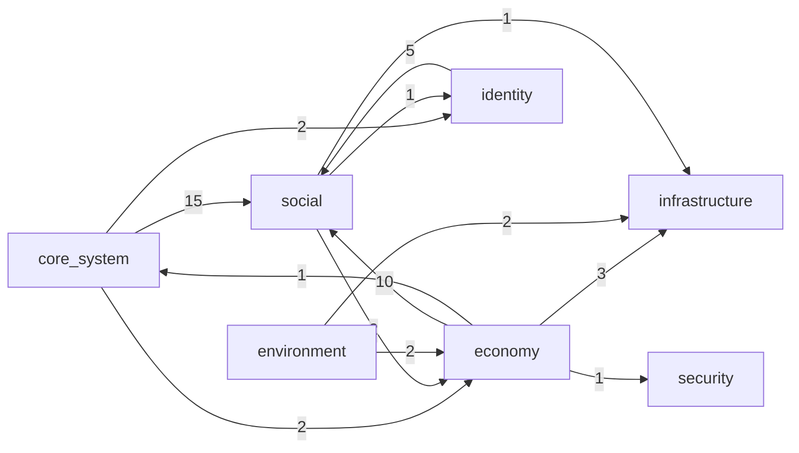

# AI Domain Kernel Visual Report

- Generated at: `2026-03-07 13:24:27Z`
- Kernel: `docs/AI_DOMAIN_KERNEL.md`
- Output: `/home/dev03wsl/sila-system/reports/ai_domain_kernel_visual_report.md`

## Summary

- Modules: **62**
- Domain groups: **8**
- ARCHITECTURE.md coverage: **62**
- Cross-domain edges: **47**

## Modules by Domain

| Domain | Modules |
| --- | ---: |
| `core_system` | 6 |
| `economy` | 13 |
| `environment` | 6 |
| `governance` | 5 |
| `identity` | 5 |
| `infrastructure` | 9 |
| `security` | 4 |
| `social` | 14 |

## Domain Relations (Mermaid)

