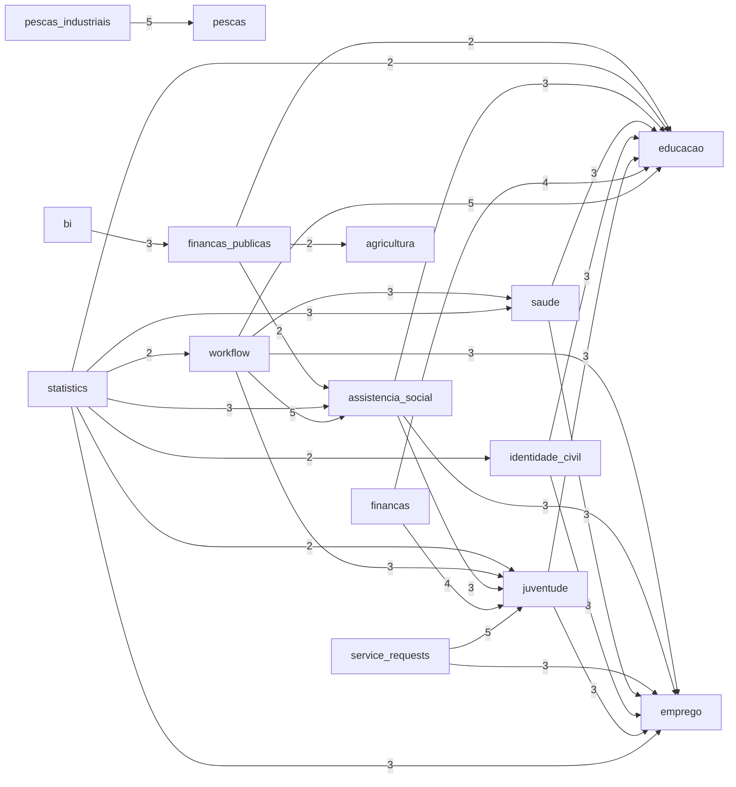

# Architecture Index Visual Report

- System: `sila-system`
- Generated at: `2026-03-07 13:24:27Z`

## Artifacts

- `ARCHITECTURE_INDEX.yaml`
- `ARCHITECTURE_DEPENDENCIES.yaml`
- `API_MAP.yaml`
- `AI_ENTRYPOINTS.yaml`
- `docs/architecture/REPOSITORY_MAP.yaml`
- `docs/AI_CONTEXT.md`
- `docs/AI_BOOTSTRAP_PROMPT.md`
- `docs/AI_ARCHITECTURE_GRAPH.yaml`
- `docs/AI_DOMAIN_KERNEL.md`
- `reports/ai_architecture_graph_visual_report.md`
- `reports/ai_domain_kernel_visual_report.md`
- `reports/domain_dependency_guardrail_report.md`
- `docs/architecture/entrypoints/`
- `docs/architecture/domains/**/ARCHITECTURE.md`
- `apps/backend/app/modules/*/ARCHITECTURE.md`

## Summary

- Modules indexed: **62**
- Dependency edges: **65**
- Circular dependency groups: **0**
- API endpoints mapped: **306**

## Dependency Graph (Top 30 Edges)

