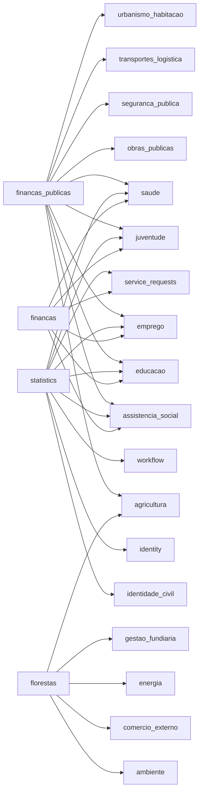

# Module Architecture Docs Visual Report

- Generated at: `2026-03-07 13:24:26Z`
- Output: `/home/dev03wsl/sila-system/reports/module_architecture_docs_visual_report.md`

## Summary

- Modules scanned: **62**
- ARCHITECTURE.md generated: **62**
- Modules with entities detected: **61**
- Modules with use cases detected: **62**
- Modules with API endpoints detected: **11**

## Coverage Matrix

| Module | Domain Group | Layers | Entities | Use Cases | API Endpoints | Dependencies |
| --- | --- | ---: | ---: | ---: | ---: | ---: |
| `administracao_local` | `governance` | 4 | 4 | 5 | 0 | 0 |
| `agricultura` | `economy` | 5 | 39 | 66 | 0 | 0 |
| `aguas_saneamento` | `infrastructure` | 5 | 21 | 33 | 0 | 0 |
| `ambiente` | `environment` | 5 | 30 | 48 | 0 | 0 |
| `apoio_empresarial` | `economy` | 4 | 1 | 1 | 0 | 0 |
| `arquivo_nacional` | `governance` | 4 | 1 | 1 | 0 | 0 |
| `assistencia_social` | `social` | 5 | 20 | 67 | 0 | 3 |
| `aviacao_civil` | `infrastructure` | 5 | 16 | 13 | 0 | 0 |
| `bi` | `core_system` | 5 | 4 | 12 | 25 | 3 |
| `ciencia_pesquisa` | `social` | 5 | 11 | 25 | 0 | 0 |
| `comercio_externo` | `economy` | 5 | 226 | 227 | 0 | 0 |
| `comercio_servicos` | `economy` | 5 | 13 | 9 | 0 | 0 |
| `cooperacao_internacional` | `governance` | 5 | 13 | 19 | 0 | 0 |
| `cultura` | `social` | 5 | 23 | 61 | 0 | 2 |
| `defesa_consumidor` | `security` | 5 | 15 | 13 | 0 | 0 |
| `desporto` | `social` | 5 | 23 | 33 | 0 | 4 |
| `educacao` | `social` | 5 | 15 | 28 | 0 | 0 |
| `emprego` | `social` | 5 | 6 | 16 | 0 | 0 |
| `energia` | `infrastructure` | 5 | 24 | 30 | 0 | 0 |
| `estatistica` | `core_system` | 5 | 16 | 46 | 0 | 0 |
| `familia` | `social` | 5 | 29 | 18 | 0 | 1 |
| `financas` | `economy` | 5 | 8 | 18 | 14 | 6 |
| `financas_impostos` | `economy` | 5 | 33 | 83 | 0 | 0 |
| `financas_publicas` | `economy` | 5 | 34 | 62 | 0 | 10 |
| `florestas` | `environment` | 5 | 112 | 39 | 0 | 5 |
| `gestao_fundiaria` | `infrastructure` | 5 | 23 | 34 | 0 | 0 |
| `identidade_civil` | `identity` | 5 | 16 | 30 | 11 | 5 |
| `identity` | `identity` | 5 | 0 | 51 | 13 | 0 |
| `igualdade` | `social` | 4 | 1 | 1 | 0 | 0 |
| `industria` | `economy` | 5 | 7 | 10 | 0 | 0 |
| `justica` | `governance` | 5 | 30 | 32 | 0 | 0 |
| `juventude` | `social` | 5 | 44 | 99 | 0 | 2 |
| `meteorologia` | `environment` | 5 | 6 | 15 | 0 | 0 |
| `migracao` | `identity` | 5 | 1 | 1 | 0 | 0 |
| `obras_publicas` | `infrastructure` | 5 | 22 | 56 | 0 | 0 |
| `operations` | `core_system` | 4 | 2 | 10 | 9 | 0 |
| `patrimonio_cultural` | `environment` | 5 | 15 | 9 | 0 | 0 |
| `pecuaria` | `economy` | 5 | 29 | 21 | 0 | 0 |
| `pescas` | `economy` | 5 | 50 | 37 | 0 | 0 |
| `pescas_industriais` | `economy` | 5 | 54 | 35 | 0 | 2 |
| `petroleo_gas` | `environment` | 4 | 1 | 1 | 0 | 0 |
| `planeamento` | `governance` | 4 | 1 | 1 | 0 | 0 |
| `portos_logistica` | `infrastructure` | 4 | 1 | 1 | 0 | 0 |
| `protecao_civil` | `security` | 5 | 14 | 27 | 0 | 0 |
| `protecao_dados` | `identity` | 4 | 1 | 1 | 0 | 0 |
| `recursos_minerais` | `environment` | 4 | 1 | 1 | 0 | 0 |
| `registo_civil` | `identity` | 5 | 9 | 16 | 0 | 0 |
| `saude` | `social` | 5 | 75 | 233 | 190 | 3 |
| `saude_primaria` | `social` | 5 | 22 | 55 | 22 | 0 |
| `seguranca_alimentar` | `security` | 4 | 1 | 1 | 0 | 0 |
| `seguranca_publica` | `security` | 5 | 32 | 54 | 0 | 0 |
| `seguranca_social` | `social` | 5 | 9 | 11 | 0 | 0 |
| `service_requests` | `core_system` | 5 | 11 | 30 | 11 | 5 |
| `statistics` | `core_system` | 5 | 4 | 28 | 18 | 9 |
| `taxpayer` | `economy` | 4 | 22 | 1 | 13 | 0 |
| `tecnologia_inovacao` | `social` | 4 | 1 | 1 | 0 | 0 |
| `telecomunicacoes` | `infrastructure` | 5 | 30 | 56 | 0 | 0 |
| `trabalho_inspecao` | `social` | 4 | 1 | 1 | 0 | 0 |
| `transportes_logistica` | `infrastructure` | 5 | 31 | 36 | 0 | 0 |
| `turismo` | `economy` | 5 | 80 | 40 | 0 | 0 |
| `urbanismo_habitacao` | `infrastructure` | 5 | 31 | 46 | 0 | 0 |
| `workflow` | `core_system` | 5 | 12 | 10 | 8 | 5 |

## Dependency Topology (Top 30 by outbound degree)

