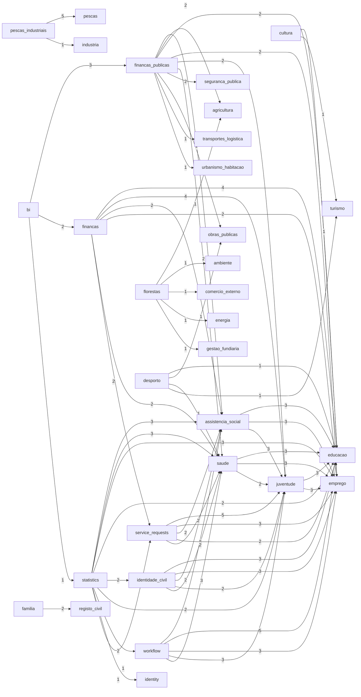

# Module Dependencies Report

- Generated at: `2026-03-07 13:24:24Z`
- Scope: `apps/backend/app/modules`

## Summary

- Modules scanned: **62**
- Python files parsed: **6976**
- Dependency edges (distinct): **65**
- Circular dependency groups: **0**

## Top Dependency Edges

| Source | Target | Import count |
| --- | --- | ---: |
| `pescas_industriais` | `pescas` | 5 |
| `service_requests` | `juventude` | 5 |
| `workflow` | `assistencia_social` | 5 |
| `workflow` | `educacao` | 5 |
| `financas` | `educacao` | 4 |
| `financas` | `juventude` | 4 |
| `statistics` | `assistencia_social` | 3 |
| `statistics` | `saude` | 3 |
| `statistics` | `emprego` | 3 |
| `juventude` | `educacao` | 3 |
| `juventude` | `emprego` | 3 |
| `identidade_civil` | `educacao` | 3 |
| `identidade_civil` | `emprego` | 3 |
| `saude` | `educacao` | 3 |
| `saude` | `emprego` | 3 |
| `service_requests` | `emprego` | 3 |
| `bi` | `financas_publicas` | 3 |
| `assistencia_social` | `educacao` | 3 |
| `assistencia_social` | `emprego` | 3 |
| `assistencia_social` | `juventude` | 3 |
| `workflow` | `emprego` | 3 |
| `workflow` | `juventude` | 3 |
| `workflow` | `saude` | 3 |
| `statistics` | `educacao` | 2 |
| `statistics` | `identidade_civil` | 2 |
| `statistics` | `juventude` | 2 |
| `statistics` | `workflow` | 2 |
| `financas_publicas` | `assistencia_social` | 2 |
| `financas_publicas` | `agricultura` | 2 |
| `financas_publicas` | `educacao` | 2 |
| `financas_publicas` | `emprego` | 2 |
| `financas_publicas` | `juventude` | 2 |
| `financas_publicas` | `saude` | 2 |
| `financas_publicas` | `seguranca_publica` | 2 |
| `identidade_civil` | `assistencia_social` | 2 |
| `identidade_civil` | `juventude` | 2 |
| `identidade_civil` | `saude` | 2 |
| `saude` | `juventude` | 2 |
| `service_requests` | `assistencia_social` | 2 |
| `service_requests` | `educacao` | 2 |
| `service_requests` | `saude` | 2 |
| `familia` | `registo_civil` | 2 |
| `bi` | `financas` | 2 |
| `financas` | `assistencia_social` | 2 |
| `financas` | `emprego` | 2 |
| `financas` | `saude` | 2 |
| `financas` | `service_requests` | 2 |
| `statistics` | `identity` | 1 |
| `statistics` | `service_requests` | 1 |
| `financas_publicas` | `obras_publicas` | 1 |

## Hotspots

### Outbound

| Module | Outbound imports | Distinct targets |
| --- | ---: | ---: |
| `statistics` | 19 | 9 |
| `workflow` | 19 | 5 |
| `financas_publicas` | 17 | 10 |
| `financas` | 16 | 6 |
| `service_requests` | 14 | 5 |
| `identidade_civil` | 12 | 5 |
| `assistencia_social` | 9 | 3 |
| `saude` | 8 | 3 |
| `juventude` | 6 | 2 |
| `pescas_industriais` | 6 | 2 |
| `bi` | 6 | 3 |
| `florestas` | 5 | 5 |
| `desporto` | 4 | 4 |
| `cultura` | 2 | 2 |
| `familia` | 2 | 1 |
| `patrimonio_cultural` | 0 | 0 |
| `saude_primaria` | 0 | 0 |
| `aviacao_civil` | 0 | 0 |
| `apoio_empresarial` | 0 | 0 |
| `industria` | 0 | 0 |
| `protecao_civil` | 0 | 0 |
| `administracao_local` | 0 | 0 |
| `arquivo_nacional` | 0 | 0 |
| `comercio_externo` | 0 | 0 |
| `energia` | 0 | 0 |
| `ambiente` | 0 | 0 |
| `obras_publicas` | 0 | 0 |
| `financas_impostos` | 0 | 0 |
| `defesa_consumidor` | 0 | 0 |
| `portos_logistica` | 0 | 0 |

### Inbound

| Module | Inbound imports |
| --- | ---: |
| `educacao` | 29 |
| `emprego` | 25 |
| `juventude` | 23 |
| `assistencia_social` | 16 |
| `saude` | 15 |
| `pescas` | 5 |
| `service_requests` | 3 |
| `agricultura` | 3 |
| `financas_publicas` | 3 |
| `identidade_civil` | 2 |
| `workflow` | 2 |
| `seguranca_publica` | 2 |
| `obras_publicas` | 2 |
| `turismo` | 2 |
| `registo_civil` | 2 |
| `financas` | 2 |
| `identity` | 1 |
| `transportes_logistica` | 1 |
| `urbanismo_habitacao` | 1 |
| `ambiente` | 1 |
| `comercio_externo` | 1 |
| `energia` | 1 |
| `gestao_fundiaria` | 1 |
| `industria` | 1 |
| `statistics` | 1 |

## Circular Dependencies

- No circular dependency groups detected.

## Dependency Graph (Mermaid)

## Evidence Samples

### `pescas_industriais` -> `pescas`

- `pescas_industriais/api/deps.py:9 from app.modules.pescas.api.deps import get_armador_service`
- `pescas_industriais/domain/models/armador_industrial.py:6 from app.modules.pescas.domain.models.armador import Armador`
- `pescas_industriais/domain/models/embarcacao_industrial.py:7 from app.modules.pescas.domain.models.embarcacao import Embarcacao`
- `pescas_industriais/application/ports/embarcacao_industrial_repository_port.py:3 from app.modules.pescas.application.ports.embarcacao_repository_port import EmbarcacaoRepositoryPort`
- `pescas_industriais/application/ports/armador_industrial_repository_port.py:3 from app.modules.pescas.application.ports.armador_repository_port import ArmadorRepositoryPort`

### `service_requests` -> `juventude`

- `service_requests/api/deps.py:18 from app.modules.juventude.infrastructure.repositories.sqlalchemy_jovem_repository import (`
- `service_requests/api/deps.py:21 from app.modules.juventude.infrastructure.repositories.sqlalchemy_programa_repository import (`
- `service_requests/infrastructure/clients/juventude_client.py:6 from app.modules.juventude.domain.enums import StatusPrograma`
- `service_requests/infrastructure/clients/juventude_client.py:7 from app.modules.juventude.infrastructure.repositories.sqlalchemy_jovem_repository import (`
- `service_requests/infrastructure/clients/juventude_client.py:10 from app.modules.juventude.infrastructure.repositories.sqlalchemy_programa_repository import (`

### `workflow` -> `assistencia_social`

- `workflow/api/deps.py:7 from app.modules.assistencia_social.infrastructure.repositories.sqlalchemy_beneficiario_repository import (`
- `workflow/api/deps.py:10 from app.modules.assistencia_social.infrastructure.repositories.sqlalchemy_visita_domiciliar_repository import (`
- `workflow/infrastructure/adapters/assistencia_social_adapter.py:6 from app.modules.assistencia_social.application.ports.beneficiario_repository_port import (`
- `workflow/infrastructure/adapters/assistencia_social_adapter.py:9 from app.modules.assistencia_social.application.ports.visita_domiciliar_repository_port import (`
- `workflow/infrastructure/adapters/assistencia_social_adapter.py:12 from app.modules.assistencia_social.domain.enums import SituacaoBeneficiario`

### `workflow` -> `educacao`

- `workflow/api/deps.py:13 from app.modules.educacao.infrastructure.repositories.sqlalchemy_matricula_repository import (`
- `workflow/api/deps.py:16 from app.modules.educacao.infrastructure.repositories.sqlalchemy_turma_repository import (`
- `workflow/infrastructure/adapters/educacao_adapter.py:5 from app.modules.educacao.application.ports import MatriculaRepositoryPort`
- `workflow/infrastructure/adapters/educacao_adapter.py:6 from app.modules.educacao.application.ports.turma_repository_port import TurmaRepositoryPort`
- `workflow/infrastructure/adapters/educacao_adapter.py:7 from app.modules.educacao.domain.models import StatusMatricula`

### `financas` -> `educacao`

- `financas/api/deps.py:9 from app.modules.educacao.infrastructure.repositories.sqlalchemy_matricula_repository import (`
- `financas/api/deps.py:12 from app.modules.educacao.infrastructure.repositories.sqlalchemy_propina_repository import (`
- `financas/infrastructure/adapters/educacao_adapter.py:3 from app.modules.educacao.application.ports.matricula_repository_port import MatriculaRepositoryPort`
- `financas/infrastructure/adapters/educacao_adapter.py:4 from app.modules.educacao.application.ports.propina_repository_port import PropinaRepositoryPort`

### `financas` -> `juventude`

- `financas/api/deps.py:31 from app.modules.juventude.infrastructure.repositories.sqlalchemy_auxilio_repository import (`
- `financas/api/deps.py:34 from app.modules.juventude.infrastructure.repositories.sqlalchemy_bolsa_estudo_repository import (`
- `financas/infrastructure/adapters/juventude_adapter.py:5 from app.modules.juventude.application.ports.auxilio_repository_port import AuxilioRepositoryPort`
- `financas/infrastructure/adapters/juventude_adapter.py:6 from app.modules.juventude.application.ports.bolsa_estudo_repository_port import BolsaEstudoRepositoryPort`

### `statistics` -> `assistencia_social`

- `statistics/integrations/assistencia_data_source.py:7 from app.modules.assistencia_social.infrastructure.models.beneficiario_model import BeneficiarioModel`
- `statistics/integrations/assistencia_data_source.py:8 from app.modules.assistencia_social.infrastructure.models.beneficio_model import BeneficioModel`
- `statistics/integrations/assistencia_data_source.py:9 from app.modules.assistencia_social.infrastructure.models.cadastro_unico_model import CadastroUnicoModel`

### `statistics` -> `saude`

- `statistics/integrations/saude_data_source.py:7 from app.modules.saude.infrastructure.models.appointment_model import AppointmentModel`
- `statistics/integrations/saude_data_source.py:8 from app.modules.saude.infrastructure.models.internamento_model import InternamentoModel`
- `statistics/integrations/saude_data_source.py:9 from app.modules.saude.infrastructure.models.vaccine_model import VaccineDoseModel`

### `statistics` -> `emprego`

- `statistics/integrations/emprego_data_source.py:7 from app.modules.emprego.infrastructure.models.candidato_model import CandidatoModel`
- `statistics/integrations/emprego_data_source.py:8 from app.modules.emprego.infrastructure.models.contrato_model import ContratoModel`
- `statistics/integrations/emprego_data_source.py:9 from app.modules.emprego.infrastructure.models.oferta_model import OfertaModel`

### `juventude` -> `educacao`

- `juventude/api/deps.py:8 from app.modules.educacao.infrastructure.repositories.sqlalchemy_matricula_repository import (`
- `juventude/infrastructure/adapters/educacao_service_adapter.py:5 from app.modules.educacao.application.ports.matricula_repository_port import (`
- `juventude/infrastructure/adapters/educacao_service_adapter.py:8 from app.modules.educacao.domain.models.matricula import StatusMatricula`

### `juventude` -> `emprego`

- `juventude/api/deps.py:11 from app.modules.emprego.infrastructure.repositories.sqlalchemy_candidato_repository import (`
- `juventude/infrastructure/adapters/emprego_service_adapter.py:5 from app.modules.emprego.application.ports.candidato_repository_port import (`
- `juventude/infrastructure/adapters/emprego_service_adapter.py:8 from app.modules.emprego.domain.enums import StatusCandidato`

### `identidade_civil` -> `educacao`

- `identidade_civil/api/citizens/citizens_routes.py:21 from app.modules.educacao.infrastructure.repositories.sqlalchemy_matricula_repository import (`
- `identidade_civil/infrastructure/adapters/educacao_service_adapter.py:6 from app.modules.educacao.application.ports import MatriculaRepositoryPort`
- `identidade_civil/infrastructure/adapters/educacao_service_adapter.py:7 from app.modules.educacao.domain.models import StatusMatricula`

### `identidade_civil` -> `emprego`

- `identidade_civil/api/citizens/citizens_routes.py:24 from app.modules.emprego.infrastructure.repositories.sqlalchemy_candidato_repository import (`
- `identidade_civil/infrastructure/adapters/emprego_service_adapter.py:6 from app.modules.emprego.application.ports import CandidatoRepositoryPort`
- `identidade_civil/infrastructure/adapters/emprego_service_adapter.py:7 from app.modules.emprego.domain.enums import StatusCandidato`

### `saude` -> `educacao`

- `saude/api/deps.py:22 from app.modules.educacao.infrastructure.repositories.sqlalchemy_matricula_repository import (`
- `saude/infrastructure/adapters/educacao_service_adapter.py:9 from app.modules.educacao.application.ports.matricula_repository_port import (`
- `saude/infrastructure/adapters/educacao_service_adapter.py:12 from app.modules.educacao.domain.models import StatusMatricula`

### `saude` -> `emprego`

- `saude/api/deps.py:25 from app.modules.emprego.infrastructure.repositories.sqlalchemy_candidato_repository import (`
- `saude/infrastructure/adapters/emprego_service_adapter.py:8 from app.modules.emprego.application.ports.candidato_repository_port import (`
- `saude/infrastructure/adapters/emprego_service_adapter.py:11 from app.modules.emprego.domain.enums import StatusCandidato`

### `service_requests` -> `emprego`

- `service_requests/api/deps.py:15 from app.modules.emprego.infrastructure.repositories.sqlalchemy_candidato_repository import (`
- `service_requests/infrastructure/clients/emprego_client.py:6 from app.modules.emprego.domain.enums import StatusCandidato`
- `service_requests/infrastructure/clients/emprego_client.py:7 from app.modules.emprego.infrastructure.repositories.sqlalchemy_candidato_repository import (`

### `bi` -> `financas_publicas`

- `bi/integrations/data_sources.py:12 from app.modules.financas_publicas.infrastructure.models.despesa_model import DespesaModel`
- `bi/integrations/data_sources.py:13 from app.modules.financas_publicas.infrastructure.models.orcamento_model import OrcamentoModel`
- `bi/integrations/data_sources.py:14 from app.modules.financas_publicas.infrastructure.models.receita_model import ReceitaModel`

### `assistencia_social` -> `educacao`

- `assistencia_social/api/deps.py:40 from app.modules.educacao.infrastructure.repositories.sqlalchemy_matricula_repository import (`
- `assistencia_social/infrastructure/adapters/educacao_service_adapter.py:5 from app.modules.educacao.application.ports.matricula_repository_port import (`
- `assistencia_social/infrastructure/adapters/educacao_service_adapter.py:8 from app.modules.educacao.domain.models.matricula import StatusMatricula`

### `assistencia_social` -> `emprego`

- `assistencia_social/api/deps.py:43 from app.modules.emprego.infrastructure.repositories.sqlalchemy_candidato_repository import (`
- `assistencia_social/infrastructure/adapters/emprego_service_adapter.py:6 from app.modules.emprego.application.ports.candidato_repository_port import (`
- `assistencia_social/infrastructure/adapters/emprego_service_adapter.py:9 from app.modules.emprego.domain.enums import StatusCandidato`

### `assistencia_social` -> `juventude`

- `assistencia_social/api/deps.py:46 from app.modules.juventude.infrastructure.repositories.sqlalchemy_jovem_repository import (`
- `assistencia_social/infrastructure/adapters/juventude_service_adapter.py:6 from app.modules.juventude.application.ports.jovem_repository_port import JovemRepositoryPort`
- `assistencia_social/infrastructure/adapters/juventude_service_adapter.py:7 from app.modules.juventude.domain.enums import TipoVulnerabilidade`

### `workflow` -> `emprego`

- `workflow/api/deps.py:19 from app.modules.emprego.infrastructure.repositories.sqlalchemy_candidato_repository import (`
- `workflow/infrastructure/adapters/emprego_adapter.py:5 from app.modules.emprego.application.ports import CandidatoRepositoryPort`
- `workflow/infrastructure/adapters/emprego_adapter.py:6 from app.modules.emprego.domain.enums import StatusCandidato`

### `workflow` -> `juventude`

- `workflow/api/deps.py:22 from app.modules.juventude.infrastructure.repositories.sqlalchemy_jovem_repository import (`
- `workflow/infrastructure/adapters/juventude_adapter.py:5 from app.modules.juventude.application.ports.jovem_repository_port import JovemRepositoryPort`
- `workflow/infrastructure/adapters/juventude_adapter.py:6 from app.modules.juventude.domain.enums import TipoVulnerabilidade`

### `workflow` -> `saude`

- `workflow/api/deps.py:25 from app.modules.saude.infrastructure.repositories.appointment_repository import (`
- `workflow/infrastructure/adapters/saude_adapter.py:5 from app.modules.saude.application.ports.appointment_repository_port import (`
- `workflow/infrastructure/adapters/saude_adapter.py:8 from app.modules.saude.domain.enums import AppointmentStatus`

### `statistics` -> `educacao`

- `statistics/integrations/educacao_data_source.py:7 from app.modules.educacao.infrastructure.models.matricula_model import MatriculaModel`
- `statistics/integrations/educacao_data_source.py:8 from app.modules.educacao.infrastructure.models.turma_model import TurmaModel`

### `statistics` -> `identidade_civil`

- `statistics/integrations/identidade_data_source.py:7 from app.modules.identidade_civil.domain.models.bi_event_record import BIEventRecord`
- `statistics/integrations/identidade_data_source.py:8 from app.modules.identidade_civil.domain.models.bi_record import BIRecord`

### `statistics` -> `juventude`

- `statistics/integrations/juventude_data_source.py:7 from app.modules.juventude.infrastructure.models.jovem_model import JovemModel`
- `statistics/integrations/juventude_data_source.py:8 from app.modules.juventude.infrastructure.models.programa_juvenil_model import ProgramaJuvenilModel`

### `statistics` -> `workflow`

- `statistics/integrations/workflow_data_source.py:8 from app.modules.workflow.infrastructure.models.workflow_instance_model import WorkflowInstanceModel`
- `statistics/integrations/workflow_data_source.py:9 from app.modules.workflow.infrastructure.models.workflow_task_model import WorkflowTaskModel`

### `financas_publicas` -> `assistencia_social`

- `financas_publicas/api/deps.py:51 from app.modules.assistencia_social.infrastructure.repositories import SQLAlchemyBeneficiarioRepository`
- `financas_publicas/infrastructure/adapters/assistencia_social_service_adapter.py:6 from app.modules.assistencia_social.application.ports.beneficiario_repository_port import (`

### `financas_publicas` -> `agricultura`

- `financas_publicas/api/deps.py:52 from app.modules.agricultura.infrastructure.repositories import SQLAlchemyProdutorRepository`
- `financas_publicas/infrastructure/adapters/agricultura_service_adapter.py:6 from app.modules.agricultura.application.ports import ProdutorRepositoryPort`

### `financas_publicas` -> `educacao`

- `financas_publicas/api/deps.py:53 from app.modules.educacao.infrastructure.repositories import SQLAlchemyMatriculaRepository`
- `financas_publicas/infrastructure/adapters/educacao_service_adapter.py:6 from app.modules.educacao.application.ports import MatriculaRepositoryPort`
