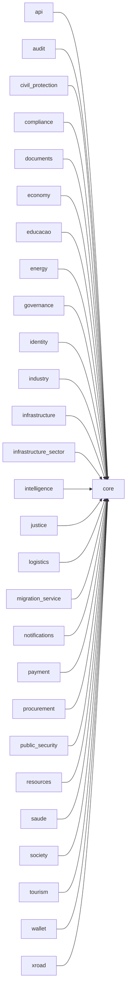

# Module Architecture Docs Visual Report

- Generated at: `2026-05-27 11:25:55Z`
- Output: `/home/dev03wsl/sila-system/reports/module_architecture_docs_visual_report.md`

## Summary

- Modules scanned: **81**
- ARCHITECTURE.md generated: **81**
- Modules with entities detected: **79**
- Modules with use cases detected: **29**
- Modules with API endpoints detected: **65**

## Coverage Matrix

| Module | Domain Group | Layers | Entities | Use Cases | API Endpoints | Dependencies |
| --- | --- | ---: | ---: | ---: | ---: | ---: |
| `_scaffold` | `unknown` | 2 | 1 | 0 | 1 | 0 |
| `administracao-local` | `unknown` | 4 | 1 | 0 | 1 | 0 |
| `agricultura` | `unknown` | 4 | 1 | 0 | 1 | 0 |
| `aguas-saneamento` | `unknown` | 4 | 1 | 0 | 1 | 0 |
| `ambiente` | `unknown` | 4 | 1 | 0 | 1 | 0 |
| `api` | `unknown` | 5 | 12 | 4 | 1 | 1 |
| `apoio-empresarial` | `unknown` | 4 | 1 | 0 | 1 | 0 |
| `arquivo-nacional` | `unknown` | 4 | 1 | 0 | 1 | 0 |
| `assistencia-social` | `unknown` | 4 | 1 | 0 | 1 | 0 |
| `audit` | `unknown` | 5 | 12 | 4 | 1 | 1 |
| `aviacao-civil` | `unknown` | 4 | 1 | 0 | 1 | 0 |
| `ciencia-pesquisa` | `unknown` | 4 | 1 | 0 | 1 | 0 |
| `civil_protection` | `unknown` | 5 | 32 | 31 | 0 | 1 |
| `comercio` | `unknown` | 4 | 1 | 0 | 1 | 0 |
| `comercio-externo` | `unknown` | 4 | 1 | 0 | 1 | 0 |
| `compliance` | `unknown` | 5 | 17 | 5 | 0 | 1 |
| `cooperacao-internacional` | `unknown` | 4 | 1 | 0 | 1 | 0 |
| `cultura` | `unknown` | 4 | 1 | 0 | 1 | 0 |
| `defesa-consumidor` | `unknown` | 4 | 1 | 0 | 1 | 0 |
| `desporto` | `unknown` | 4 | 1 | 0 | 1 | 0 |
| `documents` | `unknown` | 5 | 12 | 10 | 0 | 1 |
| `economy` | `economy` | 5 | 41 | 4 | 1 | 1 |
| `educacao` | `educacao` | 5 | 28 | 4 | 1 | 1 |
| `emprego` | `unknown` | 4 | 1 | 0 | 1 | 0 |
| `energia` | `unknown` | 4 | 1 | 0 | 1 | 0 |
| `energy` | `unknown` | 5 | 28 | 34 | 0 | 1 |
| `estatistica` | `unknown` | 4 | 1 | 0 | 1 | 0 |
| `familia` | `unknown` | 4 | 1 | 0 | 1 | 0 |
| `financas-impostos` | `unknown` | 4 | 1 | 0 | 1 | 0 |
| `florestas` | `unknown` | 4 | 1 | 0 | 1 | 0 |
| `gestao-fundiaria` | `unknown` | 4 | 1 | 0 | 1 | 0 |
| `governance` | `governance` | 5 | 20 | 4 | 1 | 1 |
| `habitacao` | `unknown` | 4 | 1 | 0 | 1 | 0 |
| `identity` | `unknown` | 5 | 22 | 4 | 0 | 1 |
| `igualdade` | `unknown` | 4 | 1 | 0 | 1 | 0 |
| `industria` | `unknown` | 4 | 1 | 0 | 1 | 0 |
| `industry` | `unknown` | 5 | 23 | 14 | 0 | 1 |
| `infrastructure` | `unknown` | 5 | 50 | 4 | 0 | 1 |
| `infrastructure_sector` | `infrastructure_sector` | 5 | 13 | 4 | 1 | 1 |
| `intelligence` | `intelligence` | 5 | 13 | 4 | 1 | 1 |
| `justica` | `unknown` | 4 | 1 | 0 | 1 | 0 |
| `justice` | `justice` | 5 | 20 | 5 | 1 | 1 |
| `juventude` | `unknown` | 4 | 1 | 0 | 1 | 0 |
| `logistics` | `unknown` | 5 | 63 | 42 | 0 | 1 |
| `marketplace` | `unknown` | 3 | 0 | 2 | 1 | 0 |
| `meteorologia` | `unknown` | 4 | 1 | 0 | 1 | 0 |
| `migracao` | `unknown` | 4 | 1 | 0 | 1 | 0 |
| `migration_service` | `unknown` | 5 | 13 | 5 | 0 | 1 |
| `notifications` | `unknown` | 4 | 2 | 7 | 0 | 1 |
| `obras-publicas` | `unknown` | 4 | 1 | 0 | 1 | 0 |
| `operations` | `unknown` | 5 | 14 | 8 | 0 | 0 |
| `patrimonio-cultural` | `unknown` | 4 | 1 | 0 | 1 | 0 |
| `payment` | `unknown` | 5 | 19 | 23 | 4 | 1 |
| `pecuaria` | `unknown` | 4 | 1 | 0 | 1 | 0 |
| `pescas` | `unknown` | 4 | 1 | 0 | 1 | 0 |
| `pescas-industriais` | `unknown` | 4 | 1 | 0 | 1 | 0 |
| `petroleo-gas` | `unknown` | 4 | 1 | 0 | 1 | 0 |
| `planeamento` | `unknown` | 4 | 1 | 0 | 1 | 0 |
| `portos-logistica` | `unknown` | 4 | 1 | 0 | 1 | 0 |
| `procurement` | `unknown` | 5 | 31 | 4 | 12 | 1 |
| `protecao-civil` | `unknown` | 4 | 1 | 0 | 1 | 0 |
| `protecao-dados` | `unknown` | 4 | 1 | 0 | 1 | 0 |
| `public_security` | `unknown` | 5 | 44 | 58 | 0 | 1 |
| `recursos-minerais` | `unknown` | 4 | 1 | 0 | 1 | 0 |
| `registo-civil` | `unknown` | 4 | 1 | 0 | 1 | 0 |
| `resources` | `resources` | 5 | 13 | 4 | 1 | 1 |
| `saude` | `unknown` | 5 | 22 | 4 | 0 | 1 |
| `seguranca-alimentar` | `unknown` | 4 | 1 | 0 | 1 | 0 |
| `seguranca-publica` | `unknown` | 4 | 1 | 0 | 1 | 0 |
| `seguranca-social` | `unknown` | 4 | 1 | 0 | 1 | 0 |
| `society` | `society` | 5 | 13 | 4 | 1 | 1 |
| `tecnologia-inovacao` | `unknown` | 4 | 1 | 0 | 1 | 0 |
| `telecomunicacoes` | `unknown` | 4 | 1 | 0 | 1 | 0 |
| `tests` | `unknown` | 0 | 0 | 0 | 0 | 0 |
| `tourism` | `unknown` | 5 | 92 | 44 | 0 | 1 |
| `trabalho-inspecao` | `unknown` | 4 | 1 | 0 | 1 | 0 |
| `transportes` | `unknown` | 4 | 1 | 0 | 1 | 0 |
| `turismo` | `unknown` | 4 | 1 | 0 | 1 | 0 |
| `urbanismo` | `unknown` | 4 | 1 | 0 | 1 | 0 |
| `wallet` | `unknown` | 4 | 2 | 7 | 0 | 1 |
| `xroad` | `unknown` | 5 | 14 | 4 | 8 | 1 |

## Dependency Topology (Top 30 by outbound degree)

