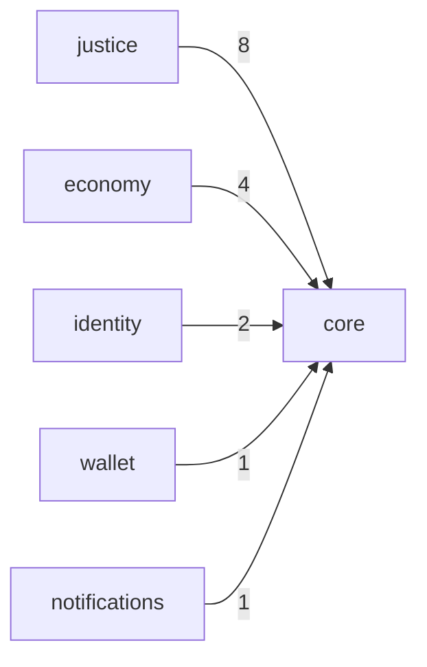

# Module Dependencies Report

- Generated at: `2026-03-16 07:44:31Z`
- Scope: `apps/backend/app/modules`

## Summary

- Modules scanned: **29**
- Python files parsed: **8237**
- Dependency edges (distinct): **5**
- Circular dependency groups: **0**

## Top Dependency Edges

| Source | Target | Import count |
| --- | --- | ---: |
| `justice` | `core` | 8 |
| `economy` | `core` | 4 |
| `identity` | `core` | 2 |
| `wallet` | `core` | 1 |
| `notifications` | `core` | 1 |

## Hotspots

### Outbound

| Module | Outbound imports | Distinct targets |
| --- | ---: | ---: |
| `justice` | 8 | 1 |
| `economy` | 4 | 1 |
| `identity` | 2 | 1 |
| `wallet` | 1 | 1 |
| `notifications` | 1 | 1 |
| `compliance` | 0 | 0 |
| `api` | 0 | 0 |
| `intelligence` | 0 | 0 |
| `resources` | 0 | 0 |
| `tests` | 0 | 0 |
| `public_security` | 0 | 0 |
| `saude` | 0 | 0 |
| `operations` | 0 | 0 |
| `society` | 0 | 0 |
| `governance` | 0 | 0 |
| `educacao` | 0 | 0 |
| `infrastructure` | 0 | 0 |
| `infrastructure_sector` | 0 | 0 |
| `payment` | 0 | 0 |
| `documents` | 0 | 0 |
| `migration_service` | 0 | 0 |
| `industry` | 0 | 0 |
| `tourism` | 0 | 0 |
| `xroad` | 0 | 0 |
| `audit` | 0 | 0 |
| `civil_protection` | 0 | 0 |
| `logistics` | 0 | 0 |
| `procurement` | 0 | 0 |
| `energy` | 0 | 0 |

### Inbound

| Module | Inbound imports |
| --- | ---: |
| `core` | 16 |

## Circular Dependencies

- No circular dependency groups detected.

## Dependency Graph (Mermaid)

## Evidence Samples

### `justice` -> `core`

- `justice/domain/events/__init__.py:9 from app.core.events.domain_event import DomainEvent, AuditableEvent, ComplianceEvent, StatusChangeEvent`
- `justice/civil_registry/adapters/__init__.py:2 from app.core.bridges.compat import AttestationServiceAdapter, CertificateServiceAdapter, FinancesServiceAdapter, NotificationServiceAdapter, RequestTrackingServiceAdapter`
- `justice/civil_registry/domain/models/__init__.py:1 from app.core.bridges.compat import Document`
- `justice/civil_registry/domain/models/document.py:1 from app.core.bridges.compat import Document`
- `justice/civil_registry/application/services/__init__.py:1 from app.core.bridges.compat import ProfileQueries, RequestState, RoutingRule`

### `economy` -> `core`

- `economy/financas/domain/models/__init__.py:1 from app.core.bridges.compat import Invoice, Payment, InvoiceStatus, PaymentStatus`
- `economy/financas/domain/models/enums.py:1 from app.core.bridges.compat import InvoiceStatus, PaymentStatus`
- `economy/financas/domain/models/payment.py:1 from app.core.bridges.compat import Payment`
- `economy/financas/domain/models/invoice.py:1 from app.core.bridges.compat import Invoice`

### `identity` -> `core`

- `identity/infrastructure/repositories/citizen_repository.py:1 from app.core.bridges.citizen_repository_bridge import CitizenRepository as CanonicalCitizenRepository`
- `identity/oidc_provider/api/health.py:2 from app.core.auth_gateway.infrastructure.security.oidc_verifier import load_oidc_config, probe_oidc_endpoints`

### `wallet` -> `core`

- `wallet/models.py:5 from app.core.db import Base`

### `notifications` -> `core`

- `notifications/models.py:5 from app.core.db import Base`
