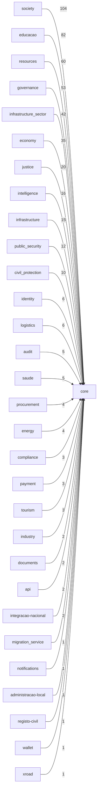

# Module Dependencies Report

- Generated at: `2026-06-07 12:12:30Z`
- Scope: `apps/backend/app/modules`

## Summary

- Modules scanned: **82**
- Python files parsed: **7556**
- Dependency edges (distinct): **30**
- Circular dependency groups: **0**

## Top Dependency Edges

| Source | Target | Import count |
| --- | --- | ---: |
| `society` | `core` | 104 |
| `educacao` | `core` | 82 |
| `resources` | `core` | 60 |
| `governance` | `core` | 53 |
| `infrastructure_sector` | `core` | 42 |
| `economy` | `core` | 35 |
| `justice` | `core` | 20 |
| `intelligence` | `core` | 16 |
| `infrastructure` | `core` | 15 |
| `public_security` | `core` | 12 |
| `civil_protection` | `core` | 10 |
| `identity` | `core` | 6 |
| `logistics` | `core` | 6 |
| `audit` | `core` | 5 |
| `saude` | `core` | 5 |
| `procurement` | `core` | 4 |
| `energy` | `core` | 4 |
| `compliance` | `core` | 3 |
| `payment` | `core` | 3 |
| `tourism` | `core` | 3 |
| `industry` | `core` | 2 |
| `documents` | `core` | 2 |
| `api` | `core` | 2 |
| `integracao-nacional` | `core` | 2 |
| `migration_service` | `core` | 1 |
| `notifications` | `core` | 1 |
| `administracao-local` | `core` | 1 |
| `registo-civil` | `core` | 1 |
| `wallet` | `core` | 1 |
| `xroad` | `core` | 1 |

## Hotspots

### Outbound

| Module | Outbound imports | Distinct targets |
| --- | ---: | ---: |
| `society` | 104 | 1 |
| `educacao` | 82 | 1 |
| `resources` | 60 | 1 |
| `governance` | 53 | 1 |
| `infrastructure_sector` | 42 | 1 |
| `economy` | 35 | 1 |
| `justice` | 20 | 1 |
| `intelligence` | 16 | 1 |
| `infrastructure` | 15 | 1 |
| `public_security` | 12 | 1 |
| `civil_protection` | 10 | 1 |
| `identity` | 6 | 1 |
| `logistics` | 6 | 1 |
| `audit` | 5 | 1 |
| `saude` | 5 | 1 |
| `procurement` | 4 | 1 |
| `energy` | 4 | 1 |
| `compliance` | 3 | 1 |
| `payment` | 3 | 1 |
| `tourism` | 3 | 1 |
| `industry` | 2 | 1 |
| `documents` | 2 | 1 |
| `api` | 2 | 1 |
| `integracao-nacional` | 2 | 1 |
| `migration_service` | 1 | 1 |
| `notifications` | 1 | 1 |
| `administracao-local` | 1 | 1 |
| `registo-civil` | 1 | 1 |
| `wallet` | 1 | 1 |
| `xroad` | 1 | 1 |

### Inbound

| Module | Inbound imports |
| --- | ---: |
| `core` | 502 |

## Circular Dependencies

- No circular dependency groups detected.

## Dependency Graph (Mermaid)

## Evidence Samples

### `society` -> `core`

- `society/application/commands.py:11 from apps.backend.app.core.events.event_bus import EventBus`
- `society/juventude/api/deps.py:9 from apps.backend.app.core.bridges import CitizenRepository, ServiceRequestLifecycleBridge`
- `society/juventude/api/deps.py:10 from apps.backend.app.core.bridges.society_repository_bridges import (`
- `society/juventude/infrastructure/models/acompanhamento_juvenil_model.py:10 from apps.backend.app.core.db import Base`
- `society/juventude/infrastructure/models/formacao_juvenil_model.py:10 from apps.backend.app.core.db import Base`

### `educacao` -> `core`

- `educacao/exceptions.py:3 from apps.backend.app.core.exceptions import BaseRequestException`
- `educacao/api/deps.py:9 from apps.backend.app.core.bridges import CitizenRepository, ServiceRequestLifecycleBridge`
- `educacao/api/deps.py:40 from apps.backend.app.core.bridges.society_repository_bridges import (`
- `educacao/application/transfer_transaction_service.py:35 from apps.backend.app.core.events.outbox.outbox_repository import OutboxRepository`
- `educacao/application/transfer_transaction_service.py:38 from apps.backend.app.core.bridges import CitizenRepositoryPort, ServiceRequestLifecycleBridge`

### `resources` -> `core`

- `resources/application/event_handlers.py:9 from apps.backend.app.core.events.domain_event import DomainEvent`
- `resources/agricultura/api/deps.py:7 from apps.backend.app.core.bridges import CitizenRepository, ServiceRequestLifecycleBridge`
- `resources/agricultura/infrastructure/models/produtor_model.py:10 from apps.backend.app.core.db import Base`
- `resources/agricultura/infrastructure/adapters/request_service_adapter.py:7 from apps.backend.app.core.bridges import ServiceRequestLifecycleBridge`
- `resources/agricultura/infrastructure/adapters/citizen_service_adapter.py:5 from apps.backend.app.core.bridges import CitizenRepositoryPort`

### `governance` -> `core`

- `governance/application/event_handlers.py:9 from apps.backend.app.core.events.domain_event import DomainEvent`
- `governance/application/commands.py:10 from apps.backend.app.core.events.event_bus import EventBus`
- `governance/domain/events/__init__.py:10 from apps.backend.app.core.events.domain_event import (`
- `governance/workflow/api/router.py:6 from apps.backend.app.core.identity import IdentityContext`
- `governance/workflow/api/deps.py:9 from apps.backend.app.core.bridges import CitizenRepository`

### `infrastructure_sector` -> `core`

- `infrastructure_sector/telecomunicacoes/api/deps.py:7 from apps.backend.app.core.bridges import CitizenRepository, ServiceRequestLifecycleBridge`
- `infrastructure_sector/telecomunicacoes/workers/outbox_worker.py:9 from apps.backend.app.core.db import AsyncSessionLocal`
- `infrastructure_sector/telecomunicacoes/infrastructure/persistence/outbox_model.py:10 from apps.backend.app.core.db import Base`
- `infrastructure_sector/telecomunicacoes/infrastructure/models/indicador_qualidade_model.py:11 from apps.backend.app.core.db import Base`
- `infrastructure_sector/telecomunicacoes/infrastructure/models/operadora_model.py:10 from apps.backend.app.core.db import Base`

### `economy` -> `core`

- `economy/application/event_handlers.py:9 from apps.backend.app.core.events.domain_event import DomainEvent`
- `economy/application/commands.py:10 from apps.backend.app.core.events.event_bus import EventBus`
- `economy/domain/events/__init__.py:11 from apps.backend.app.core.events.domain_event import (`
- `economy/financas/domain/models/__init__.py:1 from apps.backend.app.core.bridges.compat import Invoice, InvoiceStatus, Payment, PaymentStatus`
- `economy/financas/domain/models/enums.py:1 from apps.backend.app.core.bridges.compat import InvoiceStatus, PaymentStatus`

### `justice` -> `core`

- `justice/events/bus.py:3 from apps.backend.app.core.events.event_bus import InMemoryEventBus`
- `justice/application/event_handlers.py:9 from apps.backend.app.core.events.domain_event import DomainEvent`
- `justice/application/commands.py:10 from apps.backend.app.core.events.event_bus import EventBus`
- `justice/domain/events/__init__.py:11 from apps.backend.app.core.events.domain_event import (`
- `justice/civil_registry/adapters/__init__.py:3 from apps.backend.app.core.bridges.compat import (`

### `intelligence` -> `core`

- `intelligence/application/commands.py:10 from apps.backend.app.core.events.event_bus import EventBus`
- `intelligence/ciencia_pesquisa/infrastructure/models/projeto_pesquisa_model.py:11 from apps.backend.app.core.db import Base`
- `intelligence/ciencia_pesquisa/infrastructure/models/instituicao_pesquisa_model.py:10 from apps.backend.app.core.db import Base`
- `intelligence/ciencia_pesquisa/infrastructure/models/pesquisador_model.py:10 from apps.backend.app.core.db import Base`
- `intelligence/arquivo_nacional/api/routers/tabela_temporalidade_router.py:8 from apps.backend.app.core.db import get_db`

### `infrastructure` -> `core`

- `infrastructure/application/commands.py:10 from apps.backend.app.core.events.event_bus import EventBus`
- `infrastructure/infrastructure/persistence/outbox_repository.py:12 from apps.backend.app.core.db import AsyncSessionLocal`
- `infrastructure/infrastructure/persistence/outbox_model.py:10 from apps.backend.app.core.db import Base`
- `infrastructure/infrastructure/persistence/saga_model.py:10 from apps.backend.app.core.db import Base`
- `infrastructure/infrastructure/persistence/saga_repository.py:9 from apps.backend.app.core.db import AsyncSessionLocal`

### `public_security` -> `core`

- `public_security/api/deps.py:5 from apps.backend.app.core.bridges import ServiceRequestLifecycleBridge`
- `public_security/infrastructure/models/laudo_pericial_model.py:10 from apps.backend.app.core.db import Base`
- `public_security/infrastructure/models/cadeia_custodia_model.py:10 from apps.backend.app.core.db import Base`
- `public_security/infrastructure/models/mandado_model.py:10 from apps.backend.app.core.db import Base`
- `public_security/infrastructure/models/prova_pericial_model.py:10 from apps.backend.app.core.db import Base`

### `civil_protection` -> `core`

- `civil_protection/api/deps.py:7 from apps.backend.app.core.bridges import ServiceRequestLifecycleBridge`
- `civil_protection/application/event_handlers.py:9 from apps.backend.app.core.events.domain_event import DomainEvent`
- `civil_protection/application/commands.py:10 from apps.backend.app.core.events.event_bus import EventBus`
- `civil_protection/domain/events/__init__.py:10 from apps.backend.app.core.events.domain_event import (`
- `civil_protection/infrastructure/orm/bombeiro_model.py:10 from apps.backend.app.core.db import Base`

### `identity` -> `core`

- `identity/application/event_handlers.py:9 from apps.backend.app.core.events.domain_event import DomainEvent`
- `identity/application/commands.py:10 from apps.backend.app.core.events.event_bus import EventBus`
- `identity/domain/events/__init__.py:10 from apps.backend.app.core.events.domain_event import (`
- `identity/infrastructure/models/biometric_model.py:8 from apps.backend.app.core.db import Base`
- `identity/infrastructure/repositories/biometric_repository.py:5 from apps.backend.app.core.database.repositories.base_repository import BaseRepository`

### `logistics` -> `core`

- `logistics/infrastructure/orm/viagem_model.py:11 from apps.backend.app.core.db import Base`
- `logistics/infrastructure/orm/toll_passage_model.py:11 from apps.backend.app.core.db import Base`
- `logistics/infrastructure/orm/linha_model.py:11 from apps.backend.app.core.db import Base`
- `logistics/infrastructure/orm/veiculo_model.py:11 from apps.backend.app.core.db import Base`
- `logistics/infrastructure/orm/bilhetagem_evento_model.py:11 from apps.backend.app.core.db import Base`

### `audit` -> `core`

- `audit/application/event_handlers.py:9 from apps.backend.app.core.events.domain_event import DomainEvent`
- `audit/application/commands.py:10 from apps.backend.app.core.events.event_bus import EventBus`
- `audit/state_audit/infrastructure/orm/audit_case_model.py:3 from apps.backend.app.core.db import Base`
- `audit/state_audit/infrastructure/orm/audit_log_model.py:3 from apps.backend.app.core.db import Base`
- `audit/domain/events/__init__.py:10 from apps.backend.app.core.events.domain_event import (`

### `saude` -> `core`

- `saude/application/event_handlers.py:9 from apps.backend.app.core.events.domain_event import DomainEvent`
- `saude/application/commands.py:10 from apps.backend.app.core.events.event_bus import EventBus`
- `saude/infrastructure/models.py:11 from apps.backend.app.core.db import Base`
- `saude/domain/events/__init__.py:10 from apps.backend.app.core.events.domain_event import (`
- `saude/application/vaccine/vaccine_service.py:6 from apps.backend.app.core.observability import trace`

### `procurement` -> `core`

- `procurement/infrastructure/orm/supplier_model.py:3 from apps.backend.app.core.db import Base`
- `procurement/infrastructure/orm/tender_model.py:3 from apps.backend.app.core.db import Base`
- `procurement/infrastructure/orm/contract_model.py:3 from apps.backend.app.core.db import Base`
- `procurement/infrastructure/orm/bid_model.py:3 from apps.backend.app.core.db import Base`

### `energy` -> `core`

- `energy/infrastructure/persistence/outbox.py:11 from apps.backend.app.core.db import AsyncSessionLocal`
- `energy/infrastructure/models/energy_invoice_model.py:11 from apps.backend.app.core.db import Base`
- `energy/infrastructure/models/energy_telemetry_model.py:10 from apps.backend.app.core.db import Base`
- `energy/infrastructure/models/outbox_event_model.py:10 from apps.backend.app.core.db import Base`

### `compliance` -> `core`

- `compliance/application/event_handlers.py:9 from apps.backend.app.core.events.domain_event import DomainEvent`
- `compliance/application/commands.py:10 from apps.backend.app.core.events.event_bus import EventBus`
- `compliance/domain/events/__init__.py:10 from apps.backend.app.core.events.domain_event import (`

### `payment` -> `core`

- `payment/application/event_handlers.py:9 from apps.backend.app.core.events.domain_event import DomainEvent`
- `payment/domain/events/__init__.py:11 from apps.backend.app.core.events.domain_event import (`
- `payment/infrastructure/adapters/multicaixa_real_provider.py:8 from apps.backend.app.core.settings import settings`

### `tourism` -> `core`

- `tourism/application/commands.py:10 from apps.backend.app.core.events.event_bus import EventBus`
- `tourism/infrastructure/adapters/request_service_adapter.py:7 from apps.backend.app.core.bridges import ServiceRequestLifecycleBridge`
- `tourism/infrastructure/adapters/citizen_service_adapter.py:5 from apps.backend.app.core.bridges import CitizenRepositoryPort`

### `industry` -> `core`

- `industry/application/event_handlers.py:9 from apps.backend.app.core.events.domain_event import DomainEvent`
- `industry/domain/events/__init__.py:10 from apps.backend.app.core.events.domain_event import (`

### `documents` -> `core`

- `documents/application/event_handlers.py:9 from apps.backend.app.core.events.domain_event import DomainEvent`
- `documents/domain/events/__init__.py:10 from apps.backend.app.core.events.domain_event import (`

### `api` -> `core`

- `api/application/commands.py:10 from apps.backend.app.core.events.event_bus import EventBus`
- `api/domain/events/__init__.py:10 from apps.backend.app.core.events.domain_event import (`

### `integracao-nacional` -> `core`

- `integracao-nacional/subdomains/bi/infrastructure/adapters_real.py:7 from apps.backend.app.core.settings import settings`
- `integracao-nacional/subdomains/nif/infrastructure/adapters_real.py:7 from apps.backend.app.core.settings import settings`

### `migration_service` -> `core`

- `migration_service/application/commands.py:10 from apps.backend.app.core.events.event_bus import EventBus`

### `notifications` -> `core`

- `notifications/models.py:8 from apps.backend.app.core.db import Base`

### `administracao-local` -> `core`

- `administracao-local/application/event_handlers.py:9 from apps.backend.app.core.events.domain_event import DomainEvent`

### `registo-civil` -> `core`

- `registo-civil/infrastructure/adapters_real.py:7 from apps.backend.app.core.settings import settings`

### `wallet` -> `core`

- `wallet/models.py:8 from apps.backend.app.core.db import Base`

### `xroad` -> `core`

- `xroad/application/commands.py:10 from apps.backend.app.core.events.event_bus import EventBus`
