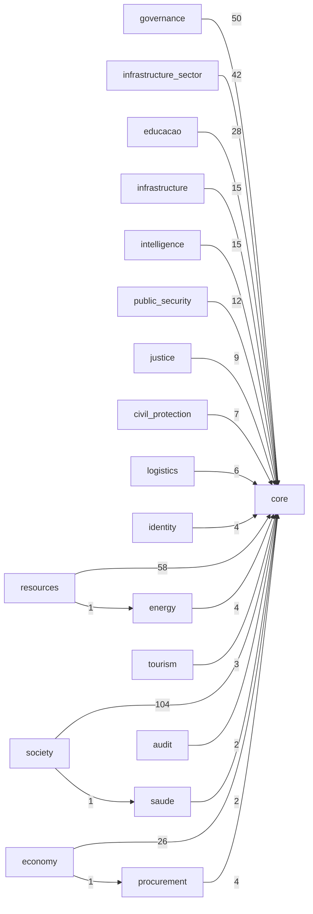

# Module Dependencies Report

- Generated at: `2026-03-13 12:26:05Z`
- Scope: `apps/backend/app/modules`

## Summary

- Modules scanned: **26**
- Python files parsed: **6321**
- Dependency edges (distinct): **21**
- Circular dependency groups: **0**

## Top Dependency Edges

| Source | Target | Import count |
| --- | --- | ---: |
| `society` | `core` | 104 |
| `resources` | `core` | 58 |
| `governance` | `core` | 50 |
| `infrastructure_sector` | `core` | 42 |
| `educacao` | `core` | 28 |
| `economy` | `core` | 26 |
| `infrastructure` | `core` | 15 |
| `intelligence` | `core` | 15 |
| `public_security` | `core` | 12 |
| `justice` | `core` | 9 |
| `civil_protection` | `core` | 7 |
| `logistics` | `core` | 6 |
| `identity` | `core` | 4 |
| `energy` | `core` | 4 |
| `procurement` | `core` | 4 |
| `tourism` | `core` | 3 |
| `saude` | `core` | 2 |
| `audit` | `core` | 2 |
| `resources` | `energy` | 1 |
| `economy` | `procurement` | 1 |
| `society` | `saude` | 1 |

## Hotspots

### Outbound

| Module | Outbound imports | Distinct targets |
| --- | ---: | ---: |
| `society` | 105 | 2 |
| `resources` | 59 | 2 |
| `governance` | 50 | 1 |
| `infrastructure_sector` | 42 | 1 |
| `educacao` | 28 | 1 |
| `economy` | 27 | 2 |
| `infrastructure` | 15 | 1 |
| `intelligence` | 15 | 1 |
| `public_security` | 12 | 1 |
| `justice` | 9 | 1 |
| `civil_protection` | 7 | 1 |
| `logistics` | 6 | 1 |
| `identity` | 4 | 1 |
| `energy` | 4 | 1 |
| `procurement` | 4 | 1 |
| `tourism` | 3 | 1 |
| `saude` | 2 | 1 |
| `audit` | 2 | 1 |
| `api` | 0 | 0 |
| `compliance` | 0 | 0 |
| `xroad` | 0 | 0 |
| `payment` | 0 | 0 |
| `operations` | 0 | 0 |
| `documents` | 0 | 0 |
| `migration_service` | 0 | 0 |
| `industry` | 0 | 0 |

### Inbound

| Module | Inbound imports |
| --- | ---: |
| `core` | 391 |
| `energy` | 1 |
| `procurement` | 1 |
| `saude` | 1 |

## Circular Dependencies

- No circular dependency groups detected.

## Dependency Graph (Mermaid)

## Evidence Samples

### `society` -> `core`

- `society/juventude/api/deps.py:5 from app.core.bridges import CitizenRepository, ServiceRequestLifecycleBridge`
- `society/juventude/api/deps.py:6 from app.core.bridges.society_repository_bridges import make_educacao_matricula_repository`
- `society/juventude/infrastructure/models/acompanhamento_juvenil_model.py:7 from app.core.db import Base`
- `society/juventude/infrastructure/models/formacao_juvenil_model.py:7 from app.core.db import Base`
- `society/juventude/infrastructure/models/saude_juvenil_model.py:7 from app.core.db import Base`

### `resources` -> `core`

- `resources/agricultura/api/deps.py:4 from app.core.bridges import CitizenRepository, ServiceRequestLifecycleBridge`
- `resources/agricultura/infrastructure/models/produtor_model.py:7 from app.core.db import Base`
- `resources/agricultura/infrastructure/adapters/request_service_adapter.py:5 from app.core.bridges import ServiceRequestLifecycleBridge`
- `resources/agricultura/infrastructure/adapters/citizen_service_adapter.py:3 from app.core.bridges import CitizenRepositoryPort`
- `resources/aguas_saneamento/infrastructure/persistence/outbox.py:8 from app.core.db import AsyncSessionLocal`

### `governance` -> `core`

- `governance/workflow/api/router.py:8 from app.core.identity import IdentityContext`
- `governance/workflow/api/deps.py:5 from app.core.bridges import CitizenRepository`
- `governance/workflow/api/deps.py:6 from app.core.bridges.society_repository_bridges import make_assistencia_beneficiario_repository, make_assistencia_visita_repository, make_educacao_matricula_repository, make_educacao_turma_repository, make_emprego_candidato_repository, make_juventude_jovem_repository, make_saude_appointment_repository`
- `governance/workflow/application/services/workflow_engine.py:5 from app.core.security import IAMClient`
- `governance/workflow/infrastructure/models/workflow_definition_model.py:6 from app.core.db import Base`

### `infrastructure_sector` -> `core`

- `infrastructure_sector/telecomunicacoes/api/deps.py:5 from app.core.bridges import CitizenRepository, ServiceRequestLifecycleBridge`
- `infrastructure_sector/telecomunicacoes/workers/outbox_worker.py:6 from app.core.db import AsyncSessionLocal`
- `infrastructure_sector/telecomunicacoes/infrastructure/persistence/outbox_model.py:7 from app.core.db import Base`
- `infrastructure_sector/telecomunicacoes/infrastructure/models/indicador_qualidade_model.py:8 from app.core.db import Base`
- `infrastructure_sector/telecomunicacoes/infrastructure/models/operadora_model.py:7 from app.core.db import Base`

### `educacao` -> `core`

- `educacao/api/deps.py:5 from app.core.bridges import CitizenRepository, ServiceRequestLifecycleBridge`
- `educacao/application/propina_service.py:1 from app.core.bridges import CitizenRepositoryPort, ServiceRequestLifecycleBridge`
- `educacao/application/workflow_service.py:7 from app.core.bridges import CitizenRepositoryPort, ServiceRequestLifecycleBridge`
- `educacao/application/formacao_service.py:1 from app.core.bridges import CitizenRepositoryPort, ServiceRequestLifecycleBridge`
- `educacao/application/emprego_service.py:1 from app.core.bridges import CitizenRepositoryPort, ServiceRequestLifecycleBridge`

### `economy` -> `core`

- `economy/core/application/payment_service.py:1 from app.core.observability import trace`
- `economy/core/application/invoice_service.py:1 from app.core.observability import trace`
- `economy/trade/external/infrastructure/models/despachante_model.py:2 from app.core.db import Base`
- `economy/trade/external/infrastructure/models/drawback_suspensao_model.py:2 from app.core.db import Base`
- `economy/trade/external/infrastructure/models/cancelamento_radar_model.py:2 from app.core.db import Base`

### `infrastructure` -> `core`

- `infrastructure/domain/infrastructure/persistence/outbox_repository.py:9 from app.core.db import AsyncSessionLocal`
- `infrastructure/domain/infrastructure/persistence/outbox_model.py:7 from app.core.db import Base`
- `infrastructure/domain/infrastructure/persistence/saga_model.py:7 from app.core.db import Base`
- `infrastructure/domain/infrastructure/persistence/saga_repository.py:6 from app.core.db import AsyncSessionLocal`
- `infrastructure/domain/infrastructure/messaging/outbox_worker.py:9 from app.core.db import AsyncSessionLocal`

### `intelligence` -> `core`

- `intelligence/ciencia_pesquisa/infrastructure/models/projeto_pesquisa_model.py:8 from app.core.db import Base`
- `intelligence/ciencia_pesquisa/infrastructure/models/instituicao_pesquisa_model.py:7 from app.core.db import Base`
- `intelligence/ciencia_pesquisa/infrastructure/models/pesquisador_model.py:7 from app.core.db import Base`
- `intelligence/arquivo_nacional/api/routers/tabela_temporalidade_router.py:6 from app.core.db import get_db`
- `intelligence/arquivo_nacional/api/routers/documento_router.py:6 from app.core.db import get_db`

### `public_security` -> `core`

- `public_security/api/deps.py:5 from app.core.bridges import ServiceRequestLifecycleBridge`
- `public_security/infrastructure/models/laudo_pericial_model.py:7 from app.core.db import Base`
- `public_security/infrastructure/models/cadeia_custodia_model.py:7 from app.core.db import Base`
- `public_security/infrastructure/models/mandado_model.py:7 from app.core.db import Base`
- `public_security/infrastructure/models/prova_pericial_model.py:7 from app.core.db import Base`

### `justice` -> `core`

- `justice/_deprecated/bounded_contexts/civil_registry_core/api/router.py:5 from app.core.db import get_db`
- `justice/_deprecated/bounded_contexts/civil_registry_core/domain/aggregates/citizen_aggregate.py:4 from app.core.events.base_event import BaseEvent`
- `justice/_deprecated/bounded_contexts/civil_registry_core/domain/aggregates/citizen_aggregate.py:5 from app.core.observability.context import get_request_id`
- `justice/_deprecated/bounded_contexts/civil_registry_core/infrastructure/repositories/citizen_repository.py:10 from app.core.database.repositories import BaseRepository`
- `justice/_deprecated/bounded_contexts/civil_registry_core/infrastructure/repositories/citizen_repository.py:11 from app.core.bridges.identity_bridge import CitizenFUC`

### `civil_protection` -> `core`

- `civil_protection/api/deps.py:5 from app.core.bridges import ServiceRequestLifecycleBridge`
- `civil_protection/infrastructure/models/bombeiro_model.py:7 from app.core.db import Base`
- `civil_protection/infrastructure/models/ocorrencia_emergencial_model.py:7 from app.core.db import Base`
- `civil_protection/infrastructure/models/despacho_model.py:7 from app.core.db import Base`
- `civil_protection/infrastructure/models/atendimento_model.py:7 from app.core.db import Base`

### `logistics` -> `core`

- `logistics/domain/infrastructure/models/viagem_model.py:8 from app.core.db import Base`
- `logistics/domain/infrastructure/models/toll_passage_model.py:10 from app.core.db import Base`
- `logistics/domain/infrastructure/models/linha_model.py:8 from app.core.db import Base`
- `logistics/domain/infrastructure/models/veiculo_model.py:8 from app.core.db import Base`
- `logistics/domain/infrastructure/models/bilhetagem_evento_model.py:8 from app.core.db import Base`

### `identity` -> `core`

- `identity/bounded_contexts/iam/application/services/citizen_event_consumer.py:1 from app.core.bridges.identity_bridge import IdentityBridge`
- `identity/infrastructure/models/user_model.py:6 from app.core.database.base import Base`
- `identity/infrastructure/repositories/user_repository.py:6 from app.core.database.session import AsyncSessionLocal`
- `identity/infrastructure/repositories/citizen_repository.py:1 from app.core.bridges.citizen_repository_bridge import CitizenRepository as CanonicalCitizenRepository`

### `energy` -> `core`

- `energy/infrastructure/persistence/outbox.py:8 from app.core.db import AsyncSessionLocal`
- `energy/infrastructure/models/energy_invoice_model.py:10 from app.core.db import Base`
- `energy/infrastructure/models/energy_telemetry_model.py:9 from app.core.db import Base`
- `energy/infrastructure/models/outbox_event_model.py:7 from app.core.db import Base`

### `procurement` -> `core`

- `procurement/core/infrastructure/orm/supplier_model.py:2 from app.core.db import Base`
- `procurement/core/infrastructure/orm/tender_model.py:2 from app.core.db import Base`
- `procurement/core/infrastructure/orm/contract_model.py:2 from app.core.db import Base`
- `procurement/core/infrastructure/orm/bid_model.py:2 from app.core.db import Base`

### `tourism` -> `core`

- `tourism/infrastructure/adapters/request_service_adapter.py:5 from app.core.bridges import ServiceRequestLifecycleBridge`
- `tourism/infrastructure/adapters/citizen_service_adapter.py:3 from app.core.bridges import CitizenRepositoryPort`
- `tourism/core/api/deps.py:5 from app.core.bridges import CitizenRepository, ServiceRequestLifecycleBridge`

### `saude` -> `core`

- `saude/infrastructure/models.py:11 from app.core.db import Base`
- `saude/application/vaccine/vaccine_service.py:7 from app.core.observability import trace`

### `audit` -> `core`

- `audit/state_audit/infrastructure/orm/audit_case_model.py:2 from app.core.db import Base`
- `audit/state_audit/infrastructure/orm/audit_log_model.py:2 from app.core.db import Base`

### `resources` -> `energy`

- `resources/florestas/api/deps.py:9 from app.modules.energy.api.deps import get_geracao_service`

### `economy` -> `procurement`

- `economy/api/router.py:3 from app.modules.procurement.api.router import router as procurement_router`

### `society` -> `saude`

- `society/desporto/api/deps.py:26 from app.modules.saude.api.deps import get_exame_service`
